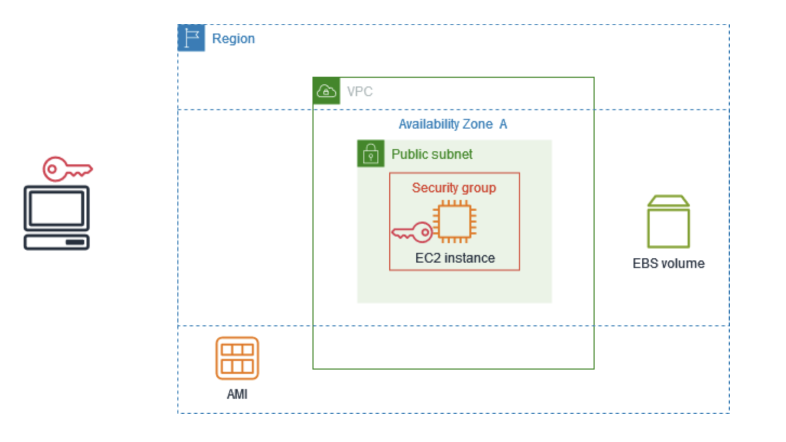

# Amazon EC2 の使用を開始

このチュートリアルを使用して、Amazon Elastic Compute Cloud (Amazon EC2) の使用を開始できます。EC2 インスタンスを起動および接続する方法について説明します。インスタンスは、AWS クラウド内の仮想サーバーです。Amazon EC2 を使用して、インスタンスで実行されるオペレーティングシステムとアプリケーションをセットアップし、設定することができます。

---

## 概要

次の図は、このチュートリアルで使用する主要コンポーネントを示しています。

- **イメージ (AMI)**：オペレーティングシステムなど、インスタンスで実行されるソフトウェアを含むテンプレート。
- **キーペア**：インスタンスへの接続時にユーザーの ID を証明するのに使用する一連のセキュリティ認証情報。パブリックキーはインスタンス上、プライベートキーはコンピュータ上にあります。
- **ネットワーク**：仮想プライベートクラウド (VPC) は、AWS アカウント専用の仮想ネットワークです。デフォルト VPC とサブネットが用意されている。
- **セキュリティグループ**：仮想ファイアウォールとして機能し、インバウンドトラフィックとアウトバウンドトラフィックを制御。
- **EBS ボリューム**：ルートボリュームは必須。任意でデータボリュームを追加可能。

---

## このチュートリアルのコスト

- AWS アカウント作成後、無料利用枠を使用して EC2 を無料で使用可能。
- 無料利用枠対象外の場合は、インスタンス起動中から終了まで標準料金が発生。
- 無料利用枠の対象かどうかを確認するには、「Amazon EC2 の無料利用枠の使用状況を追跡する」を参照。

---

## タスク

### ステップ 1: インスタンスを起動する

1. [EC2 コンソール](https://console.aws.amazon.com/ec2/) を開く。
2. AWS リージョンを選択。
3. [インスタンスを起動] を選択。
4. 名前やタグを設定。
5. [クイックスタート] で OS を選択（Linux では Amazon Linux 推奨）。
6. 無料利用枠対象の AMI を選択。
7. インスタンスタイプ（無料利用枠対象）を選択。
8. キーペアを作成または既存を選択。
   - キーペアなしでは接続不可。
9. ネットワーク設定を確認。
   - デフォルト VPC とサブネットを使用。
   - インバウンドルールはテスト用なら `0.0.0.0/0`。実運用では限定。
10. ストレージ設定を確認。
    - ルートボリュームのみで十分。
11. [Launch instance] を選択。
12. インスタンスの状態が `running` になり、ステータスチェックに合格すると接続可能。

---

### ステップ 2: インスタンスに接続する

- OS によって接続方法が異なる：
  - **Linux** → SSH
  - **Windows** → RDP
- 接続できない場合は「Amazon EC2 Linux インスタンスへの接続に関する問題のトラブルシューティング」を参照。

---

### ステップ 3: インスタンスをクリーンアップする

- 使用後はインスタンスを終了（削除）。
- 停止で保持しつつ料金発生を抑えることも可能。
- 終了後はコンソールにしばらく表示されるが、自動で削除される。

#### インスタンス終了手順

1. ナビゲーションペインで [インスタンス] を選択。
2. 終了するインスタンスを選択。
3. [インスタンスの状態] → [インスタンスの終了 (削除)] を選択。
4. 確認メッセージで [終了 (削除)] を選択。

---

## 次のステップ

- EC2 のコア概念を確認
- 無料利用枠の使用状況を追跡
- CloudWatch でアラーム設定
- EBS ボリューム追加
- AWS Systems Manager でリモート管理
- インスタンス購入オプション・タイプの選定とレコメンデーション確認
