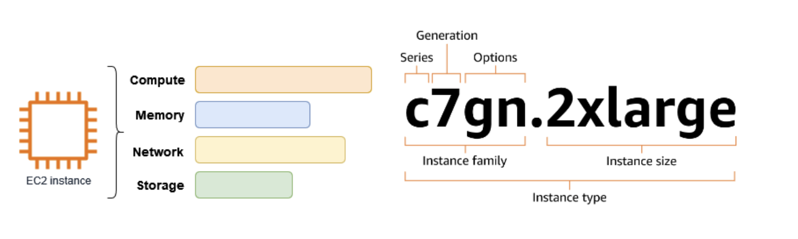

# Amazon EC2

**Amazon Elastic Compute Cloud (EC2)** は、AWSクラウド上でオンデマンドのスケーラブルなコンピューティングキャパシティーを提供するサービスです。  
ハードウェアコストを削減し、アプリケーションの開発とデプロイを迅速に行うことができます。

EC2を使用すると、必要な数の仮想サーバー（EC2インスタンス）を起動し、セキュリティ・ネットワーク設定やストレージ管理が可能です。  
負荷に応じてインスタンスをスケールアップ・スケールダウンできます。

---

## EC2インスタンス

- **仮想サーバー**として動作
- 起動時に指定する **インスタンスタイプ** によって、CPU・メモリ・ネットワーク・ストレージの構成が決定

---

## Amazon EC2 の主要機能

| 機能 | 説明 |
|------|------|
| インスタンス | 仮想サーバー |
| Amazon マシンイメージ (AMI) | OSやソフトウェアをパッケージ化したテンプレート |
| インスタンスタイプ | CPU・メモリ・ストレージ・ネットワークの構成 |
| Amazon EBS ボリューム | 永続的ストレージ |
| インスタンスストアボリューム | 一時データ用のストレージ（停止/終了で消える） |
| キーペア | 安全なログイン情報（公開鍵/秘密鍵） |
| セキュリティグループ | 仮想ファイアウォール（アクセス制御） |

**自分メモ**
 まとめ：用途での使い分け
| サービス | 使いどころ |
|----------|------------|
| **EBS**  | EC2 インスタンスのローカル的な高速ストレージ、OS/アプリデータ |
| **RDS**  | 構造化データの管理、トランザクションやSQL操作が必要なDB |
| **S3**   | 大容量オブジェクト保存、バックアップ、静的コンテンツ配信 |

ポイントは **「アクセス方法」と「データ構造」** です。
- **EBS** → ブロックデバイス（低レイテンシ、EC2専用）  
- **RDS** → SQLデータベース（構造化データ）  
- **S3** → オブジェクトストレージ（HTTPアクセス、大容量ファイル）

---

## 関連サービス

- **Amazon EC2 Auto Scaling**：負荷に応じてインスタンス数を自動調整
- **AWS Backup**：インスタンスとEBSボリュームのバックアップ自動化
- **Amazon CloudWatch**：モニタリング
- **エラスティックロードバランシング**：トラフィックの自動分散
- **Amazon GuardDuty**：不正アクセス検知
- **EC2 イメージビルダー**：カスタムAMIの作成・管理
- **AWS Launch Wizard**：リソースの自動設定・デプロイ
- **AWS Systems Manager**：大規模運用管理

### コンピューティングの代替サービス

- **Amazon Lightsail**：低価格・予測可能な月額料金で簡単にウェブサイトやアプリをデプロイ
- **Amazon ECS**：コンテナ化アプリの管理・スケーリング
- **Amazon EKS**：Kubernetesアプリの管理

---

## Amazon EC2 へのアクセス方法

- **EC2コンソール**：ブラウザから管理
- **AWS CLI**：コマンドラインで操作
- **AWS CloudFormation**：テンプレートでリソース作成
- **AWS SDK**：プログラムからAPI経由で操作
- **AWS Tools for PowerShell**：PowerShellで管理
- **Query API**：HTTP/HTTPSリクエストで操作

---

## 料金体系

- **無料利用枠**：一定条件で無料
- **オンデマンドインスタンス**：使用秒単位で課金
- **積立プラン**：1～3年契約で割引
- **予約インスタンス**：1～3年契約で割引
- **スポットインスタンス**：未使用リソースを安価に利用
- **専用ホスト**：専用物理サーバーでの利用
- **オンデマンドキャパシティ予約**：特定AZのインスタンスを予約

1秒単位の課金で、未使用分は請求されません。

---

## 見積・請求・コスト最適化

- **AWS料金見積りツール**：使用見積もり
- **AWS Cost Explorer**：コスト分析・将来予測
- **AWS Trusted Advisor**：コスト、セキュリティ、パフォーマンスの最適化
- **クラウドエコノミクスセンター**：プロビジョニング環境のコスト計算