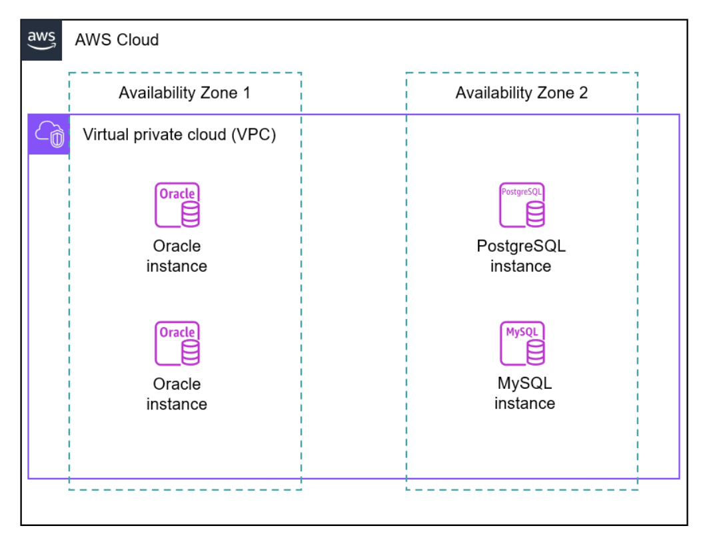
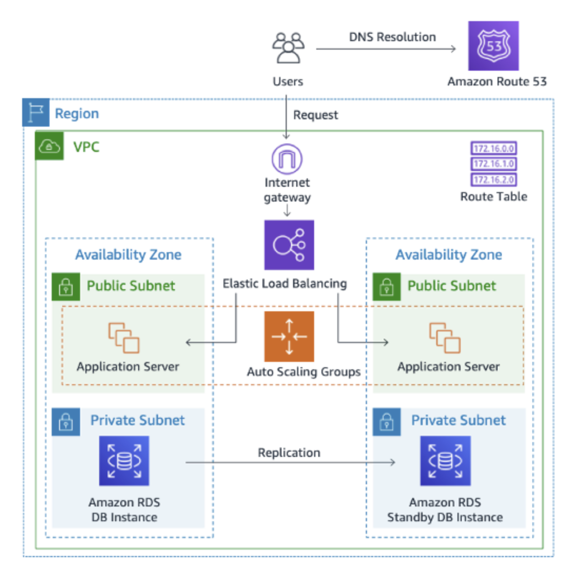
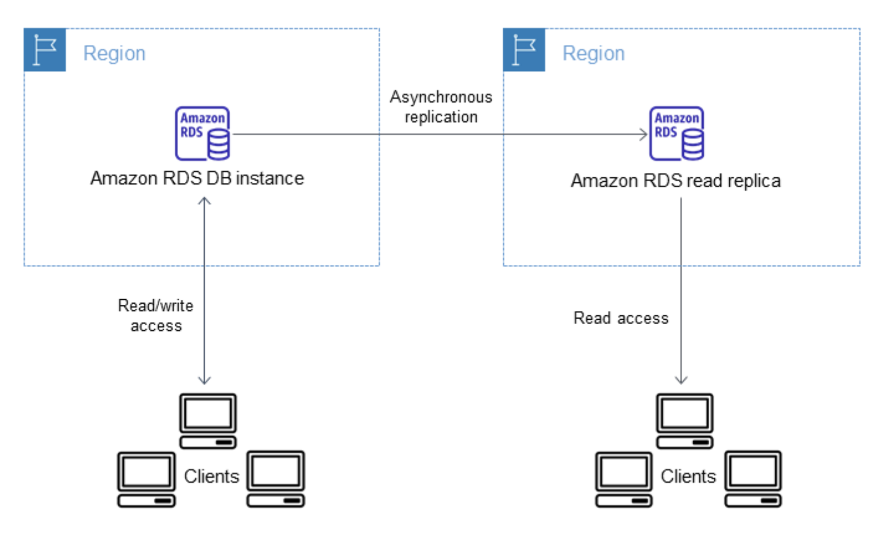
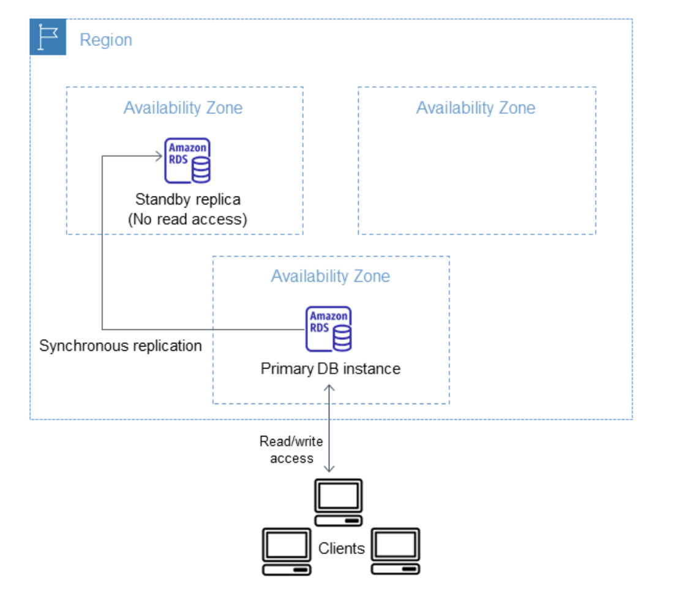
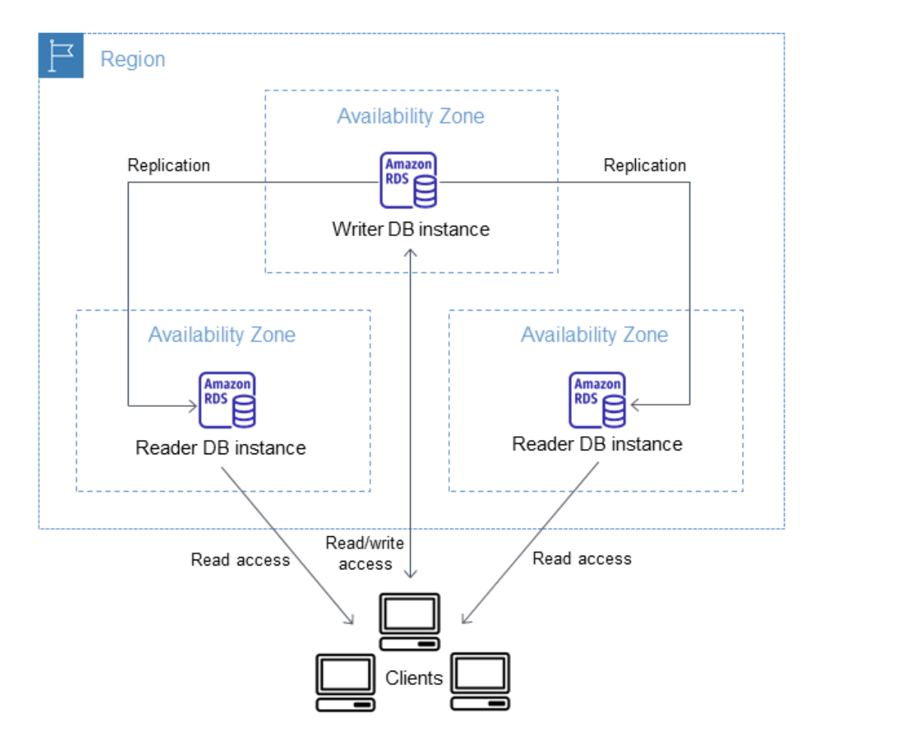
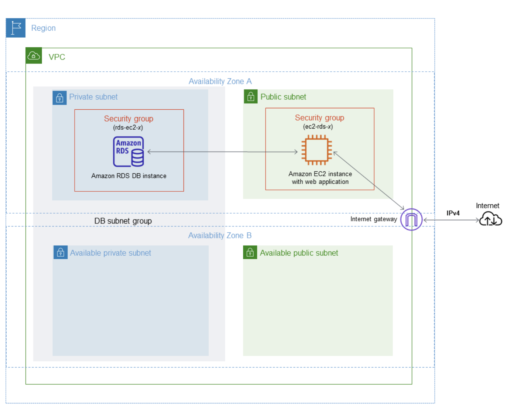

# Amazon RDS ユーザーガイド

## Amazon Relational Database Service (Amazon RDS) とは

Amazon Relational Database Service (Amazon RDS) は、AWS クラウド でリレーショナルデータベースを簡単にセットアップし、運用し、スケーリングすることのできるウェブサービスです。業界スタンダードのリレーショナルデータベース向けに、費用対効果に優れたエクステンションを備え、一般的なデータベース管理タスクを管理します。

### 注記

このガイドでは、Amazon Aurora 以外の Amazon RDS データベースエンジンについて説明しています。Amazon Aurora の使用については、Amazon Aurora ユーザーガイドを参照してください。

AWS の製品やサービスを初めて使用する場合、詳細については、以下のリソースを参照してください。

- すべての AWS 製品の概要については、「クラウドコンピューティングとは」を参照してください。
- AWS で利用できるさまざまなデータベースオプションの詳細については、「AWS データベースサービスの選択」と「AWS でのデータベースの実行」を参照してください。

## Amazon RDS の利点

Amazon RDS はマネージドデータベースサービスです。これは、ほとんどの管理タスクを担っています。Amazon RDS では、面倒な手動プロセスを排除することでアプリケーションとユーザーに集中することができます。

Amazon RDS は、フルマネージドではないデータベースデプロイに比べて、次のプリンシパルな利点があります。

- IBM Db2、MariaDB、Microsoft SQL Server、MySQL、Oracle Database、PostgreSQL など既に使い慣れたデータベースエンジンを使用できます。
- Amazon RDS では、バックアップ、ソフトウェアパッチ、自動的な障害検出、および復旧を管理します。
- 自動バックアップをオンにするか、マニュアルで独自のバックアップスナップショットを作成できます。これらのバックアップを使用してデータベースを復元できます。Amazon RDS の復元は信頼性の高い効率的なプロセスです。
- プライマリ DB インスタンスと同期しているセカンダリ DB インスタンスがあると、問題が発生したときにセカンダリインスタンスにフェイルオーバーできるので、高可用性を実現できます。また、リードレプリカを使用して、読み取りスケーリングを拡張できます。
- データベースパッケージのセキュリティに加え、AWS Identity and Access Management (IAM) を使用してユーザーとアクセス許可を定義すると、アクセスを制御できます。また、仮想プライベートクラウド (VPC) に配置すると、データベースを保護することもできます。

## Amazon EC2 とオンプレミスデプロイの責任の比較

ほとんどのリレーショナルデータベースデプロイでは、デフォルトの選択肢として Amazon RDS をお勧めしています。以下の代替方法には、ソフトウェアとハードウェアの管理により多くの時間を費やすという欠点があります。

### オンプレミスのデプロイ

オンプレミスサーバーを購入するときは、CPU、メモリ、ストレージ、IOPS をすべて一緒にまとめて入手します。サーバー、オペレーティングシステム、およびデータベースソフトウェアに関する全責任を負うものとします。

### Amazon EC2

Amazon Elastic Compute Cloud (Amazon EC2) は、AWS クラウドでスケーラブルなコンピューティング容量を提供します。オンプレミスのサーバーとは異なり、CPU、メモリ、ストレージ、IOPS は分離されているため、個別にスケールできます。AWS はハードウェアレイヤーを管理するため、オンプレミスのデータベースサーバーを管理する負担の一部を軽減します。

Amazon EC2 でデータベースを実行することの欠点は、ユーザーエラーが発生しやすいことです。例えば、OSまたはデータベースソフトウェアをマニュアルで更新すると、誤ってアプリケーションのダウンタイムが発生する可能性があります。問題の特定と修正のため、すべての変更をチェックするのに何時間も費やすことがあります。

**自分メモ**
```
### Amazon EC2（簡単版）
- **Amazon EC2** は、クラウド上で自由にサーバーを作って使えるサービスです。  
- オンプレミスのサーバーと違って、**CPU・メモリ・ストレージ・IOPS** を別々に増減できるので、必要に応じて性能を調整できます。  
- ハードウェアの管理（壊れたら直すなど）は AWS がやってくれるので、自分で全部管理する手間が減ります。

#### 注意点
- 自分で OS やデータベースを更新する必要があるので、操作ミスでアプリが止まることがあります。  
- 問題が起きると、どこで何が悪いのか確認するのに時間がかかることがあります。

> まとめ：自由度が高いけど、管理も自分でやる必要があるサーバー。
```
### 管理モデルの比較

| 機能 | オンプレミスの管理 | Amazon EC2 の管理 | Amazon RDS の管理 |
|------|------------------|-----------------|-----------------|
| アプリケーションの最適化 | カスタマー | カスタマー | カスタマー |
| スケーリング | カスタマー | カスタマー | AWS |
| 高可用性 | カスタマー | カスタマー | AWS |
| データベースバックアップ | カスタマー | カスタマー | AWS |
| データベースソフトウェアのパッチ適用 | カスタマー | カスタマー | AWS |
| データベースソフトウェアのインストール | カスタマー | カスタマー | AWS |
| OS のパッチ適用 | カスタマー | カスタマー | AWS |
| OS インストール | カスタマー | カスタマー | AWS |
| サーバーのメンテナンス | カスタマー | AWS | AWS |
| ハードウェアライフサイクル | カスタマー | AWS | AWS |
| 電力、ネットワーク、冷却 | カスタマー | AWS | AWS |

## Amazon RDS 責任共有モデル

Amazon RDS は、DB インスタンスと DB クラスターのソフトウェアコンポーネントとインフラストラクチャをホストする責任があります。ユーザーはクエリチューニングに責任があります。これは、SQL クエリを調整してパフォーマンスを向上させるプロセスです。クエリのパフォーマンスは、データベースの設計、データサイズ、データ分布、アプリケーションのワークロード、クエリパターンに大きく依存しますが、これらは大きく異なる可能性があります。モニタリングとチューニングは、RDS データベースごとに高度に個別化されたプロセスです。Amazon RDS Performance Insights やその他のツールを使用して、問題のあるクエリを特定できます。

**自分メモ**
```
## Amazon RDS 責任共有モデル（簡単版）
- **Amazon RDS** は、データベースのソフトウェアやサーバーの管理を担当します。
  - 例：バックアップ、パッチ適用、障害対応など
- **ユーザー** は、SQL クエリの最適化（**クエリチューニング**）に責任があります。
  - クエリチューニング：データベースの処理を速くするために、SQL を調整する作業
- クエリの速度や効率は、次のような要素によって大きく変わります：
  - データベースの設計
  - データ量や分布
  - アプリケーションの負荷（ワークロード）
  - SQL クエリの書き方（パターン）
- **ポイント**：クエリの監視と調整は、RDS データベースごとに異なるため、個別に行う必要があります。
- **ツール例**：
  - Amazon RDS Performance Insights
  - その他モニタリングツールで問題のあるクエリを特定可能
```

## Amazon RDS DB インスタンス

DB インスタンスは AWS クラウド 内の独立したデータベース環境です。Amazon RDS の基本的な構成要素は DB インスタンスです。DB インスタンスには、ユーザーが作成した1つ以上のデータベースを含めることができます。

DB インスタンスには、スタンドアロンデータベースインスタンスで使用するものと同じツールおよびアプリケーションを使用してアクセスすることができます。AWS Command Line Interface (AWS CLI)、Amazon RDS API、または AWS Management Console を使用して、DB インスタンスを作成および変更することができます。




DB インスタンスには、スタンドアロンデータベースインスタンスで使用するものと同じツールおよびアプリケーションを使用してアクセスすることができます。AWS Command Line Interface (AWS CLI)、Amazon RDS API、または AWS Management Console を使用して、DB インスタンスを作成および変更することができます。


## Amazon RDS アプリケーションアーキテクチャの例
次の図は、データベースストレージに Amazon RDS DB インスタンスを使用する動的ウェブサイトの一般的なユースケースを示しています。




上記のアーキテクチャの主なコンポーネントは次のとおりです。

エラスティックロードバランシング  
AWS は、Elastic Load Balancing を介してユーザートラフィックをルーティングします。ロードバランサーは、ワークロードを仮想サーバーなど複数のコンピューティングリソース間に分散させます。このサンプルユースケースでは、Elastic ロードバランサーはクライアントリクエストをアプリケーションサーバーに転送します。

アプリケーションサーバー  
アプリケーションサーバーは RDS DB インスタンスとやり取りします。AWS のアプリケーションサーバーは通常、スケーラブルなコンピューティング容量を提供する EC2 インスタンスでホストされます。アプリケーションサーバーは、同じ仮想プライベートクラウド (VPC) 内の異なるアベイラビリティーゾーン (AZ) を持つパブリックサブネットに存在します。

RDS DB インスタンス  
EC2 アプリケーションサーバーは RDS DB インスタンスとやり取りします。DB インスタンスは、同じ仮想プライベートクラウド(VPC) 内の異なるアベイラビリティゾーン (AZ) 内にあるプライベートサブネットに存在します。サブネットはプライベートであるため、インターネットからのリクエストは許可されません。

プライマリ DB インスタンスは、リードレプリカと呼ばれる別の DB インスタンスにレプリケートします。両方の DB インスタンスは VPC 内のプライベートサブネットにあります。つまり、インターネットユーザーが直接アクセスすることはできません。


## DB エンジン

Amazon RDS は以下の DB エンジンをサポートしています。

- IBM Db2
- MariaDB
- Microsoft SQL Server
- MySQL
- Oracle Database
- PostgreSQL

各 DB エンジンには、独自のサポートされている機能があり、AWS リージョン と DB エンジンのバージョンによって異なります。

## DB インスタンスクラス

DB インスタンスクラスによって DB インスタンスのコンピューティングとメモリの容量を決定します。DB インスタンスクラスは、DB インスタンスクラスタイプとサイズの両方で構成されます。Amazon RDS では、次のインスタンスクラスタイプがサポートされています。アスタリスク (*) は世代、オプションの属性、サイズを表します。

- 凡用 − db.m*
- メモリ最適化 – db.z*、db.x*、db.r*
- コンピューティング最適化 − db.c*
- バースト可能パフォーマンス – db.t*

インスタンスクラスごとに異なるコンピューティング､メモリ､ストレージ昨日が提供されます。例えば、db.m7g は AWS Graviton3 プロセッサを搭載した第 7 世代の汎用 DB インスタンスクラスのタイプです。DB インスタンスを作成するときは、db.m7g.2xlarge などの DB インスタンスクラスを指定します。ここで 2xlarge はサイズです。各インスタンスクラスのハードウェア仕様の詳細については、「DB インスタンスクラスのハードウェア仕様」を参照してください。

お客様の要件に最も合う DB インスタンスクラスを選択できます。要件が時間の経過とともに変化する場合は、DB インスタンスクラスを変更できます。例えば、db.m7g.2xlarge インスタンスを db.m7g.4xlarge にスケールアップできます。詳細については、「 DB インスタンスクラス」を参照してください。

注記  
DB インスタンスクラスの料金情報については、Amazon RDS 製品ページの料金表セクションを参照してください。

## DB インスタンスストレージ

Amazon EBS は、実行中のインスタンスにアタッチできる、堅牢なブロックレベルのストレージボリュームを提供します。DB インスタンスストレージには、次のタイプがあります。

汎用 (SSD)  
この費用対効果の高いストレージタイプは、中規模の DB インスタンスで実行される幅広いワークロードに最適です。汎用ストレージは、開発およびテスト環境に適しています。

プロビジョンド IOPS (PIOPS)  
このストレージタイプは、低 I/O レイテンシーおよび一貫した I/O スループットを必要とする I/O 集約型ワークロード、特にデータベースワークロードのニーズを満たすように設計されています。プロビジョンド IOPS ストレージは本稼働環境に最適です。

マグネティック  
また、Amazon RDS は下位互換性のためにマグネティックストレージをサポートしています。新しいストレージが必要な場合には、汎用 SSD またはプロビジョンド IOPS SSD の使用が推奨されます。

ストレージタイプは、パフォーマンス特性と価格に違いがあります。データベースの要件に応じてストレージのパフォーマンスとコストを調整できます。

各 DB インスタンスは、サポートするストレージタイプやデータベースエンジンによって最小/最大ストレージ要件が異なります。データベースの増加に対応できるように、十分なストレージを確保しておくことが大切です。また、十分なストレージがあると、DB エンジンの機能がコンテンツやログエントリを書き込むスペースが確保されます。詳細については、「Amazon RDS DB インスタンスストレージ」を参照してください。

## Amazon Virtual Private Cloud (VPC)

Amazon Virtual Private Cloud (Amazon VPC) サービスを使用して、virtual private cloud (VPC) 上の DB インスタンスを実行できます。VPC を使用する場合、仮想ネットワーキング環境を制御できます。独自の IP アドレスの範囲を選択し、サブネットを作成してルーティングおよびアクセス制御リストを設定できます。

VPC で実行していてもいなくても、Amazon RDS の基本機能には違いはありません。Amazon RDS では、バックアップ、ソフトウェアパッチ、自動的な障害検出、および復旧を管理します。VPC で DB インスタンスを実行するために、追加料金はかかりません。RDS で Amazon VPC を使用する方法については、「Amazon VPC と Amazon RDS」を参照してください。

Amazon RDS は Network Time Protocol (NTP) を使用して DB インスタンスの時刻を同期します。


## AWS リージョン およびアベイラビリティゾーン

Amazon クラウドコンピューティングリソースは、世界各地 (例えば、北米、ヨーロッパ、アジア) の高可用性のデータセンター施設に収容されています。各データセンターの場所は、AWS リージョンと呼ばれます。Amazon RDS を使用すると、複数のリージョンに DB インスタンスを作成できます。

次のシナリオでは、あるリージョンの RDS DB インスタンスが、別のリージョンのスタンバイ DB インスタンスに非同期的にレプリケートしています。一方のリージョンが使用できなくなっても、もう一方のリージョンのインスタンスは引き続き使用できます。




### アベイラビリティーゾーン
各 AWS リージョンは、アベイラビリティーゾーンまたは AZ と呼ばれる複数の区切られた場所で構成されています。各アベイラビリティーゾーンは、他のアベイラビリティーゾーンの障害から分離されるように設計されています。アベイラビリティーゾーンは、同じ AWS リージョン内の他のアベイラビリティーゾーンに低価格かつ低レイテンシーのネットワーク接続を提供します。個別のアベイラビリティーゾーンで DB インスタンスを起動することにより、1 つの場所で発生した障害からアプリケーションを保護できます。詳細については、「リージョン、アベイラビリティーゾーン、および Local Zones」を参照してください。

### マルチ AZ 配置
オプションで、マルチ AZ 配置と呼ばれる複数のアベイラビリティゾーンの DB インスタンスを実行できます。このオプションを選択すると、Amazon が 1 つまたは複数のセカンダリスタンバイ DB インスタンスを別の AZ で自動的にプロビジョニングして管理します。プライマリ DB インスタンスは、アベイラビリティーゾーン間で各セカンダリ DB インスタンスにレプリケートされます。

マルチ AZ 配置には、次の利点があります。

- データの冗長性とフェイルオーバーサポートの提供

- I/O フリーズの排除

- システムバックアップ中のレイテンシースパイクの最小化

- セカンダリ DB インスタンスでの読み込みトラフィックの処理 (マルチ AZ DB クラスターのデプロイのみ)

下の図は、マルチ AZ DB インスタンスのデプロイを表しており、Amazon RDS は、異なるアベイラビリティーゾーンで同期スタンバイレプリカを自動的にプロビジョンおよび維持します。レプリカデータベースは読み込みトラフィックを処理しません。

**自分メモ**
```
マルチ AZ DB インスタンスとは？
マルチ AZ は 耐障害性（高可用性） のための仕組みです。

プライマリ（本番）DB が 1 台ある
別の AZ にスタンバイ DB をリアルタイム同期して保持
書き込み（更新）操作は常にプライマリへ送られる
スタンバイ DB は待機専用
→ 読み取り（SELECT）リクエストは処理しない
```



下の図は、マルチ AZ DB クラスターのデプロイを表しており、同じ AWS リージョンの 3 つの別々のアベイラビリティーゾーンに 1 つのライター DB インスタンスと 2 つのリーダー DB インスタンスがあります。3 つの DB インスタンスはすべて読み込みトラフィックを処理できます。



詳細については、「Amazon RDS でのマルチ AZ 配置の設定と管理」を参照してください。

## セキュリティグループによるアクセスコントロール

セキュリティグループは、指定した IP アドレス範囲または Amazon EC2 インスタンスへのアクセスを許可することで、DB インスタンスへのアクセスを制御します。セキュリティグループは 1 つ以上の DB インスタンスに関連付けることができます。

VPC 内の DB インスタンスの一般的な用途は、同じ VPC 内のアプリケーションサーバーとデータを共有することです。以下の例では、VPC セキュリティグループ ec2-rds-x を使用して、クライアントアプリケーションの IP アドレスをソースとして使用するというインバウンドルールを定義します。アプリケーションサーバーはこのセキュリティグループに属します。rds-ec2-x という名前の 2 番目のセキュリティグループは、ソースとして ec2-rds-x を指定し、RDS DB インスタンスにアタッチします。セキュリティグループのルールによると、クライアントアプリケーションは DB インスタンスに直接アクセスできませんが、EC2 インスタンスは DB インスタンスにアクセスできます。

**自分メモ*＊
```
## セキュリティグループによる RDS へのアクセス制御
- セキュリティグループは、指定した IP アドレス範囲または Amazon EC2 インスタンスへのアクセスを許可することで、DB インスタンスへのアクセスを制御する
- セキュリティグループは 1 つ以上の DB インスタンスに関連付けできる

## VPC 内での DB インスタンスの一般的な用途
- 同じ VPC 内のアプリケーションサーバーとデータを共有するために利用される

## セキュリティグループ設定例
- セキュリティグループ `ec2-rds-x`
  - インバウンドルールでクライアントアプリケーションの IP アドレスをソースとして許可
  - アプリケーションサーバー（EC2）がこの SG を使用

- セキュリティグループ `rds-ec2-x`
  - ソースとして `ec2-rds-x` を指定
  - RDS DB インスタンスにアタッチ

## アクセス結果
- クライアントアプリケーションは DB インスタンスへ直接アクセスできない
- EC2 インスタンスは DB インスタンスへアクセスできる
```


VPC 内の DB インスタンスと EC2 インスタンス



セキュリティグループの詳細については、Amazon RDS でのセキュリティ を参照してください。


## Amazon RDS のモニタリング

モニタリングは、Amazon RDS およびその他の AWS ソリューションの信頼性、可用性、パフォーマンスを維持する上で重要な部分です。AWS には、Amazon RDS を監視したり、問題が発生したときに報告したり、必要に応じて自動アクションを実行したりするためのモニタリングツールが用意されています。

さまざまな自動ツールや手動ツールを使用して、DB インスタンスのパフォーマンスとヘルスを追跡できます。

---

### Amazon RDS インスタンスのステータスと推奨事項

Amazon RDS コンソール、AWS CLI、RDS API を使用して、インスタンスの現在のステータスに関する詳細を表示します。また、DB インスタンス、リードレプリカ、DB パラメータグループなどのデータベースリソースに対して自動化された推奨事項に対応できます。詳細については、「Amazon RDS の推奨事項」を参照してください。

---

### Amazon RDS の Amazon CloudWatch メトリクス

Amazon CloudWatch サービスを使用して、DB インスタンスのパフォーマンスとヘルス状態をモニタリングできます。CloudWatch のパフォーマンスチャートは、Amazon RDS コンソールに表示されます。Amazon RDS は、アクティブな各データベースのメトリクスを 1 分ごとに CloudWatch に自動送信します。CloudWatch の Amazon RDS メトリクスに対する追加料金は発生しません。

Amazon CloudWatch アラームを使用すると、特定の期間にわたって 1 つの Amazon RDS メトリクスを監視できます。そのため、設定したしきい値に関連するメトリクスの値に基づいて、1 つ以上のアクションを実行できます。詳細については、「Amazon CloudWatch を使用した Amazon RDS メトリクスのモニタリング」を参照してください。

---

### Amazon RDS Performance Insights とオペレーティングシステムのモニタリング

Performance Insights は、データベースの負荷を評価し、アクションを実行するタイミングと場所を判断します。詳細については、「Amazon RDS での Performance Insights を使用したDB 負荷のモニタリング」を参照してください。Amazon RDS 拡張モニタリングは、オペレーティングシステムのメトリクスをリアルタイムで参照します。詳細については、「拡張モニタリングを使用した OS メトリクスのモニタリング」を参照してください。

---

### 統合 AWS のサービス

Amazon RDS は、Amazon EventBridge、Amazon CloudWatch Logs、および Amazon DevOps Guru と統合されています。詳細については、「Amazon RDS インスタンスでのメトリクスのモニタリング」を参照してください。


## Amazon RDS のユーザーインターフェイス

Amazon RDS は複数の方法でやり取りできます。

### トピック
- AWS Management Console
- コマンドラインインターフェイス
- Amazon RDS API

---

### AWS Management Console

AWS Management Console はシンプルなウェブベースのユーザーインターフェイスです。プログラミングなしでコンソールから DB インスタンスを管理できます。Amazon RDS コンソールにアクセスするには、AWS Management Consoleにサインインして Amazon RDS コンソール (https://console.aws.amazon.com/rds/) を開きます。

RDS コンソールのホームページ。左側のパネルには、ダッシュボード、データベースなどのリンクがあります。中央パネルには、DB インスタンスなどのリソースが一覧表示されます。

---

### コマンドラインインターフェイス

AWS Command Line Interface (AWS CLI) を使用して、Amazon RDS API にインタラクティブにアクセスできます。AWS CLI をインストールするには、「AWS コマンドラインインターフェイスのインストール」を参照してください。RDS 用に AWS CLI の使用をスタートするには、「Amazon RDS の AWS Command Line Interface リファレンス」を参照してください。

---

### Amazon RDS API

開発者は、API を使用して、プログラムから Amazon RDS にアクセスできます。詳細については、「Amazon RDS API リファレンス」を参照してください。

アプリケーション開発には、AWS ソフトウェアデプロイキット (SDK) のいずれかを使用することをお勧めします。AWS SDK が、認証、再試行ロジック、エラー処理などの低レベルの詳細な処理を実行するため、ユーザーはアプリケーションのロジックに専念することができます。AWS SDK は、さまざまな言語で利用可能です。詳細については、Amazon Web Services のツールを参照してください。

AWS では、より簡単に使用をスタートできるように、ライブラリ、サンプルコード、チュートリアルなどのリソースを提供しています。詳細については、「サンプルコードとライブラリ」を参照してください。

---

## Amazon RDS の課金方法

Amazon RDS を使用する場合、オンデマンド DB インスタンスを使用するかリザーブド DB インスタンスを使用するかを選択できます。詳細については、「Amazon RDS 向け DB インスタンスの請求」を参照してください。

Amazon RDS の料金情報については、Amazon RDS の製品ページを参照してください。

---

## Amazon RDS の AWS 無料利用枠

Amazon RDS の AWS 無料利用枠 は、次のエンジンと DB インスタンスクラスと共に使用できます。

### エンジンタイプ
- MariaDB
- MySQL
- PostgreSQL
- SQL Server Express Edition

### DB インスタンスクラス
- **t3.micro** – すべてのエンジンタイプ用
- **t4g.micro** – SQL Server Express Edition を除くすべてのエンジンタイプ用

---

### AWS 無料利用枠 では使用できないもの

- Amazon RDS Custom エンジンオプション
- リザーブド DB インスタンス
- シングル AZ 以外のデプロイオプション
- スナップショットの移行
- クエリエディタ
- Aurora リードレプリカの作成

これらの制限は、AWS 無料利用枠 プログラムの進化に伴って変更される可能性があります。AWS 無料利用枠 についての詳細は、「AWS 無料利用枠 で AWS を試す」を参照してください。Amazon RDS 無料利用枠の詳細については、「Amazon RDS 無料利用枠」を参照してください。

---

2025 年 7 月 17 日より前に利用を開始したお客様は、12 か月間の無料利用の有効期限が切れるまで Amazon RDS 無料利用枠を引き続き使用できます。この期間中は、次の使用資格が維持されます。

- Amazon RDS で MySQL、MariaDB、または PostgreSQL を実行するシングル AZ db.t3.micro および db.t4g.micro インスタンスクラスの毎月 750 時間
- Amazon RDS で SQL Server Express Edition を実行する db.t3.micro インスタンスクラスの毎月 750 時間

2025 年 7 月 17 日以降、AWS で作成した新しい AWS 無料利用枠 リソースには新しい AWS 無料利用枠 サービスが適用されます。


