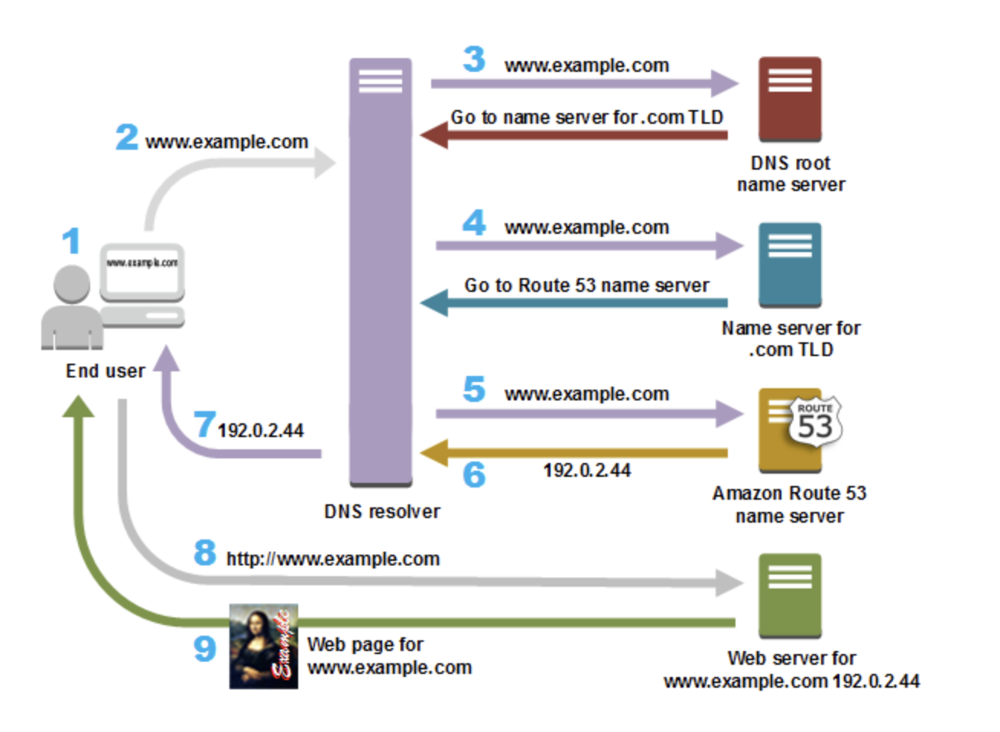

# ウェブサイトやウェブアプリケーションへのインターネットトラフィックのルーティング

インターネット上のすべてのコンピュータは、スマートフォンやラップトップの接続から、大規模な小売サイトのコンテンツに対応するサーバーに至るまで、番号を使用して相互に通信します。これらの番号は、IP アドレスと呼ばれ、以下のいずれかの形式になります。

- インターネットプロトコルバージョン 4 (IPv4) 形式 (192.0.2.44 など)
- インターネットプロトコルバージョン 6 (IPv6) 形式 (2001:0db8:85a3:0000:0000:abcd:0001:2345 など)

ブラウザを開いてウェブサイトにアクセスするときは、このような長い文字列を覚えて入力する必要はありません。代わりに、example.com のようなドメイン名を入力しても、正しい場所にアクセスできます。Amazon Route 53 などの DNS サービスにより、ドメイン名と IP アドレスとを結び付けることができます。

---

## ドメインのインターネットトラフィックをルーティングするように Amazon Route 53 を設定する方法の概要

ここでは、Amazon Route 53 コンソールを使用してドメイン名を登録し、ウェブサイトやウェブアプリケーションにインターネットトラフィックをルーティングするように Route 53 を設定する方法の概要を示します。

1. お客様のユーザーがコンテンツへのアクセスに使用するドメイン名を登録します。概要については、「ドメイン登録の仕組み」を参照してください。
2. ドメイン名を登録した後、Route 53 はドメインと同じ名前のパブリックホストゾーンを自動的に作成します。詳細については、「パブリックホストゾーンの使用」を参照してください。
3. リソースにトラフィックをルーティングするには、レコード (リソースレコードセット) をホストゾーンに作成します。各レコードには、ドメインのトラフィックをどのようにルーティングするかについて、以下のような情報が含まれます。
   - **名前**: レコードの名前は、Route 53 でトラフィックをルーティングするドメイン名 (example.com) またはサブドメイン名 (www.example.com、retail.example.com) に対応します。  
     ホストゾーン内の各レコードの名前は、ホストゾーンの名前で終わる必要があります。例えば、ホストゾーンの名前が example.com の場合、すべてのレコード名は example.com で終わる必要があります。Route 53 コンソールはこの処理を自動的に行います。
   - **タイプ**: レコードタイプによって通常、トラフィックをルーティングする先のリソースのタイプが決まります。例えば、トラフィックを E メールサーバーにルーティングするには、[Type] で [MX] を指定します。IPv4 IP アドレスが割り当てられたウェブサーバーにトラフィックをルーティングするには、[Type] で [A] を指定します。
   - **値**: 値は [Type] と密接に関連します。[Type] で [MX] を指定する場合は、[Value] で 1 つ以上の E メールサーバーの名前を指定します。[Type] で [A] を指定する場合は、IP アドレスを IPv4 形式 (192.0.2.136 など) で指定します。  
     レコードの詳細については、「レコードを使用する」を参照してください。
   - エイリアスレコードと呼ばれる特殊な Route 53 レコードを作成して、トラフィックを Amazon S3 バケット、Amazon CloudFront ディストリビューション、およびその他の AWS リソースにルーティングすることもできます。詳細については、「エイリアスレコードと非エイリアスレコードの選択」および「AWS リソースへのインターネットトラフィックのルーティング」を参照してください。

リソースへのインターネットトラフィックのルーティングについては、「DNS サービスとしての Amazon Route 53 の設定」を参照してください。

---

## Amazon Route 53 によりドメインのトラフィックをルーティングする方法

ウェブサーバーや Amazon S3 バケットなどのリソースにインターネットトラフィックをルーティングするように Amazon Route 53 を設定した後に、誰かが www.example.com のコンテンツをリクエストすると、ほんの数ミリ秒で何が起こるかを以下に示します。




1. ユーザーがウェブブラウザを開き、アドレスバーに www.example.com を入力して、Enter キーを押します。
2. www.example.com のリクエストは DNS リゾルバーにルーティングされます。DNS リゾルバーは通常、ケーブルインターネットプロバイダー、DSL ブロードバンドプロバイダー、企業ネットワークなど、ユーザーのインターネットサービスプロバイダー (ISP) によって管理されます。
```
メモ：DNSリゾルバー
```
3. ISP の DNS リゾルバーは、www.example.com のリクエストを DNS ルートネームサーバーに転送します。
4. DNS リゾルバーは www.example.com のリクエストを今度は .com ドメインのいずれかの TLD ネームサーバーに再び転送します。.com ドメインのネームサーバーは、example.com ドメインに関連付けられている 4 つの Route 53 ネームサーバーの名前でリクエストに応答します。
5. DNS リゾルバーは、4 つの Route 53 ネームサーバーをキャッシュ (保存) します。次回に誰かが example.com を参照すると、すでに example.com のネームサーバーがあるため、ステップ 3 および 4 はスキップされます。通常、ネームサーバーは 2 日間キャッシュされます。
6. DNS リゾルバーは、Route 53 ネームサーバーを選択し、www.example.com のリクエストをそのネームサーバーに転送します。
7. Route 53 ネームサーバーは、example.com ホストゾーンで www.example.com レコードを検索し、関連付けられた値 (ウェブサーバーの IP アドレス 192.0.2.44 など) を取得して、IP アドレスを DNS リゾルバーに返します。
8. DNS リゾルバーには最終的に、ユーザーが必要とする IP アドレスがあります。リゾルバーは、その値をウェブブラウザに返します。
9. ウェブブラウザは、DNS リゾルバーから取得した IP アドレスに www.example.com のリクエストを送信します。これは、Amazon EC2 インスタンスで実行されているウェブサーバー、ウェブサイトエンドポイントとして設定されている Amazon S3 バケットなど、お客様のコンテンツが置かれている場所です。
10. 192.0.2.44 にあるウェブサーバーなどのリソースは、www.example.com のウェブページをウェブブラウザに返し、ウェブブラウザはそのページを表示します。

> **注記**  
> DNS リゾルバーは、指定された期間、example.com の IP アドレスをキャッシュして、次回に誰かが example.com を参照すると、より高速に応答できるようにもします。詳細については、「time to live (TTL)」を参照してください。
