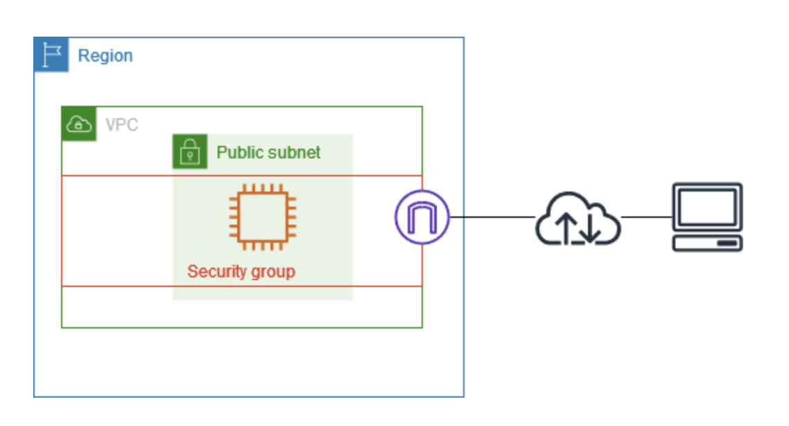
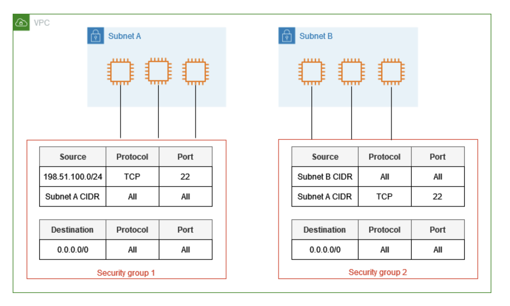

# セキュリティグループを使用して AWS リソースへのトラフィックを制御する

セキュリティグループは、関連付けられたリソースに到達するトラフィックおよびリソースから離れるトラフィックを制御します。例えば、セキュリティグループを EC2 インスタンスに関連付けると、インスタンスのインバウンドトラフィックとアウトバウンドトラフィックが制御されます。

VPC を作成すると、デフォルトのセキュリティグループが使用されます。VPC ごとに追加のセキュリティグループを作成し、それぞれに独自のインバウンドルールとアウトバウンドルールを設定できます。インバウンドルールごとに、送信元、ポート範囲、プロトコルを指定できます。アウトバウンドルールごとに、送信先、ポート範囲、プロトコルを指定できます。

次の図は、サブネット、インターネットゲートウェイ、セキュリティグループを備えた VPC を示しています。サブネットには EC2 インスタンスが含まれています。セキュリティグループは、インスタンスに割り当てられます。セキュリティグループは、仮想ファイアウォールとして機能します。インスタンスに到達するトラフィックは、セキュリティグループのルールで許可されているトラフィックだけです。例えば、ネットワークからインスタンスへの ICMP トラフィックを許可するルールがセキュリティグループに含まれている場合は、お使いのコンピュータからインスタンスに ping を送信できます。SSH トラフィックを許可するルールがセキュリティグループに含まれていない場合、SSH を使用してインスタンスに接続することはできません。



**自分メモ**
```
# セキュリティグループの役割（簡単説明）
- **セキュリティグループ**は、AWSのリソース（例：EC2インスタンス）への出入りの「トラフィックの門番」のようなものです。
  - インバウンド（外から入ってくる通信）
  - アウトバウンド（リソースから出ていく通信）
- EC2 インスタンスにセキュリティグループを設定すると、その通信ルールに従ってアクセスが許可されたり遮断されたりします。

---

## ポイント
1. **VPCを作ると自動でデフォルトのセキュリティグループが付く**
2. **追加で作れる**
   - インバウンドルール：誰からアクセスできるか、どのポートを使えるか、どのプロトコルかを設定
   - アウトバウンドルール：どこに通信できるか、ポートやプロトコルを設定
3. **仮想ファイアウォールとして機能**
   - 許可されていないトラフィックはブロック
   - 例えば：
     - ICMP（ping）を許可していれば、自分のPCからインスタンスにpingできる
     - SSHを許可していなければ、SSH接続はできない

---

## 例え
セキュリティグループ = 建物の警備員  
- 許可された人（トラフィック）だけ中に入れる  
- 許可されていない人は門前払い
```

---

## 内容

- セキュリティグループの基本
- セキュリティグループの例
- セキュリティグループのルール
- デフォルトのセキュリティグループ
- セキュリティグループの作成
- セキュリティグループのルールを設定する
- セキュリティグループを削除する
- セキュリティグループを複数の VPCに関連付ける
- AWS Organizations とセキュリティグループを共有する
- 料金

---

## セキュリティグループの基本

セキュリティグループ VPC 関連付け機能を使用してセキュリティグループを同じリージョン内の他の VPC に関連付ける場合は、セキュリティグループをセキュリティグループと同じ VPC 内に作成されたリソースに割り当てるか、他の VPC リソースに割り当てることができます。1 つのリソースに複数のセキュリティ グループを割り当てることもできます。

# セキュリティグループの VPC 関連付け
**自分メモ**
```
- **同じリージョン内の別VPCへの関連付け**
  - セキュリティグループを作成したVPC内のリソースだけでなく、同じリージョン内の別VPCのリソースにも割り当て可能
- **1つのリソースに複数のセキュリティグループを割り当て可能**
  - 例：EC2インスタンスにセキュリティグループAとセキュリティグループBを同時に適用して、複数のアクセスルールを組み合わせることができる
```

セキュリティグループを作成する場合、名前と説明を指定する必要があります。以下のルールが適用されます。

- セキュリティグループ名は VPC 内で一意である必要があります。
- セキュリティグループ名では大文字と小文字が区別されません。
- 名前と説明の長さは最大 255 文字とすることができます。
- 名前と説明に使用できる文字は、a～z、A～Z、0～9、スペース、._-:/()#,@[]+=&;{}!$* です。
- 名前に末尾のスペースが含まれている場合は、名前の末尾のスペースを削除します。例えば、名前に「セキュリティグループのテスト 」と入力すると、「セキュリティグループのテスト」として保存されます。
- セキュリティグループ名は、sg- で開始できません。
- セキュリティグループはステートフルです。例えば、インスタンスからリクエストを送信した場合、そのリクエストのレスポンストラフィックは、インバウンドセキュリティグループのルールに関係なく、インスタンスに到達が許可されます。許可されたインバウンドトラフィックへのレスポンスは、アウトバウンドルールに関係なく、インスタンスを離れることができます。
- セキュリティグループでは、以下で送受信されるトラフィックはフィルターされません。
  - Amazon ドメインネームサービス (DNS)
  - Amazon Dynamic Host Configuration Protocol (DHCP)
  - Amazon EC2 インスタンスメタデータ
  - Amazon ECS タスクメタデータエンドポイント
  - Windows インスタンスのライセンスアクティベーション
  - Amazon Time Sync Service
  - デフォルトの VPC ルーターによる予約済み IP アドレス

VPC あたりの作成可能なセキュリティグループの数、各セキュリティグループに追加できるルールの数、ネットワークインターフェイスに関連付けることができるセキュリティグループの数にはクォータがあります。詳細については、「Amazon VPC クォータ」を参照してください。

---

## ベストプラクティス

- 特定の IAM プリンシパルのみにセキュリティグループの作成と変更を許可します。
- エラーのリスクを減らすために、必要最小限の数のセキュリティグループを作成してください。各セキュリティグループを使用して、同様の機能とセキュリティ要件を持つリソースへのアクセスを管理します。
- EC2 インスタンスにアクセスできるようにするために、ポート 22 (SSH) または 3389 (RDP) のインバウンドルールを追加する場合は、特定の IP アドレスの範囲のみを許可する必要があります。0.0.0.0/0 (IPv4) と ::/ (IPv6) を指定すると、指定したプロトコルを使用して、誰でも任意の IP アドレスからインスタンスにアクセスできるようになります。
- 広い範囲のポートを開かないでください。各ポートからのアクセスが、それを必要とする送信元または宛先に制限されていることを確認します。
- セキュリティの追加レイヤーを VPC に追加するには、セキュリティグループと同様のルールを指定したネットワーク ACL を作成することを検討してください。セキュリティグループとネットワーク ACL の違いの詳細については、「セキュリティグループとネットワーク ACL を比較する」を参照してください。

**自分メモ**
```
# ネットワーク ACL (Access Control List) とは
- **概要**  
  ネットワーク ACL（NACL）は、VPC内のサブネット単位でトラフィックを制御するセキュリティ機能です。  
  セキュリティグループがインスタンス単位の「ステートフル」ファイアウォールであるのに対し、ネットワークACLはサブネット単位の「ステートレス」ファイアウォールです。
```

---

## セキュリティグループの例

次の図は、2 つのセキュリティグループと 2 つのサブネットを持つ VPC を示しています。サブネット A のインスタンスは、接続要件が同じであるため、セキュリティグループ 1 に関連付けられます。サブネット B のインスタンスは、接続要件が同じであるため、セキュリティグループ 2 に関連付けられます。セキュリティグループのルールでは、トラフィックを次のように許可します。

- セキュリティグループ 1 の最初のインバウンドルールは、指定されたアドレス範囲 (例えば、独自のネットワーク内の範囲) からサブネット A のインスタンスへの SSH トラフィックを許可します。
- セキュリティグループ 1 の 2 番目のインバウンドルールは、サブネット A のインスタンスが任意のプロトコルとポートを使用して相互に通信することを許可します。
- セキュリティグループ 2 の最初のインバウンドルールは、サブネット B のインスタンスが任意のプロトコルとポートを使用して相互に通信することを許可します。
- セキュリティグループ 2 の 2 番目のインバウンドルールは、サブネット A のインスタンスが SSH を使用してサブネット B のインスタンスと通信することを許可します。
- どちらのセキュリティグループも、すべてのトラフィックを許可するデフォルトのアウトバウンドルールを使用します。

2 つのサブネットに 2 つのセキュリティグループとサーバーを持つ VPC。サブネット A のサーバーは、セキュリティグループ 1 に関連付けられています。サブネット B のサーバーは、セキュリティグループ 2 に関連付けられています。

