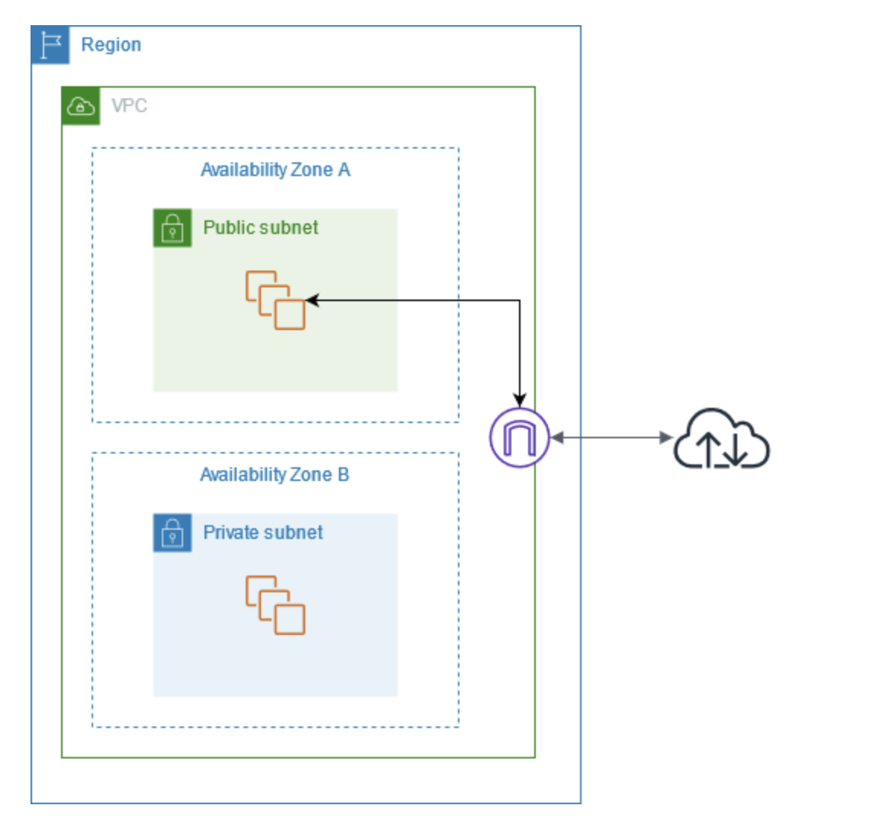

# インターネットゲートウェイを使用して VPC のインターネットアクセスを有効にする

インターネットゲートウェイは、VPC とインターネットとの間の通信を可能にする VPC コンポーネントであり、冗長性と高い可用性を備えており、水平スケーリングが可能です。IPv4 トラフィックおよび IPv6 トラフィックをサポートしています。ネットワークトラフィックに可用性のリスクや帯域幅の制約が発生することはありません。

インターネットゲートウェイを使用すると、リソースにパブリック IPv4 アドレスまたは IPv6 アドレスがある場合、パブリックサブネット内のリソース (EC2 インスタンスなど) がインターネットに接続できるようになります。同様に、インターネット上のリソースはパブリック IPv4 アドレスまたは IPv6 アドレスを使用してサブネット内のリソースへの接続を開始できます。例えば、インターネットゲートウェイを使用すると、ローカルコンピュータを使用して AWS の EC2 インスタンスに接続できます。

インターネットゲートウェイは、インターネットルーティング可能なトラフィックの VPC ルートテーブル内のターゲットを提供します。IPv4 を使用した通信の場合、インターネットゲートウェイは、ネットワークアドレス変換 (NAT) も実行します。詳細については、「IP アドレスおよび NAT」を参照してください。

**自分メモ**
```
# インターネットゲートウェイ（Internet Gateway）
インターネットゲートウェイは、**VPC（Virtual Private Cloud）とインターネットの通信を可能にするコンポーネント**です。以下の特徴があります。

- **高可用性**：冗長性があり、障害に強い設計。
- **水平スケーリング対応**：トラフィック量に応じて自動的にスケール。
- **IPv4 / IPv6 対応**：両方のトラフィックをサポート。
- **可用性リスクや帯域幅制約なし**：ネットワークのボトルネックや障害の心配が少ない。

## 主な機能
1. **インターネット接続の提供**
   - パブリック IPv4 または IPv6 アドレスを持つリソース（例：EC2 インスタンス）が、パブリックサブネット内からインターネットにアクセス可能。
   - インターネット上のリソースも、パブリックアドレスを使ってVPC内のリソースに接続可能。
   - 例：ローカルコンピュータから AWS EC2 インスタンスへの接続が可能。

2. **ルートテーブルのターゲット提供**
   - インターネットに送信するトラフィックをルートテーブルで指定可能。
   - IPv4 の場合、**NAT（ネットワークアドレス変換）** を自動的に実行。
     - VPC 内のプライベート IP とパブリック IP を相互に変換。
     - VPC 内のプライベート IP がそのまま外部に公開されることはない。
```
## 料金
インターネットゲートウェイには課金されませんが、インターネットゲートウェイを使用する EC2 インスタンスにはデータ転送料金が発生します。詳細については、「Amazon EC2 オンデマンド料金」を参照してください。

## 内容
- インターネットゲートウェイの基本
- サブネットへのインターネットアクセスを追加する
- インターネットゲートウェイを削除する

## インターネットゲートウェイの基本
インターネットゲートウェイを使用するには、インターネットゲートウェイを VPC にアタッチしてルーティングを設定する必要があります。

### ルーティング設定
サブネットに関連付けられているルートテーブルにインターネットゲートウェイへのルートがある場合、そのサブネットは「パブリックサブネット」と呼ばれます。インターネットゲートウェイへのルートを持たないルートテーブルに関連付けられているサブネットは、「プライベートサブネット」と呼ばれます。

パブリックサブネットのルートテーブルでは、インターネットゲートウェイのルートに、ルートテーブルに明示的に知られていないすべての送信先 (IPv4 の場合は 0.0.0.0/0、IPv6 の場合は ::/0) を指定することができます。または、より狭い範囲の IP アドレスにルートを絞り込むこともできます。例えば、AWS 外部にある会社のパブリックエンドポイントのパブリック IPv4 アドレスや、VPC 外部にある他の Amazon EC2 インスタンスの Elastic IP アドレスなどです。

**自分メモ**
```
# パブリックサブネットとプライベートサブネット
VPC 内のサブネットは、**ルートテーブルにインターネットゲートウェイ（IGW）へのルートがあるかどうか**で分類されます。

- **パブリックサブネット**  
  - ルートテーブルにインターネットゲートウェイへのルートがあるサブネット。  
  - インターネットと直接通信可能。

- **プライベートサブネット**  
  - ルートテーブルにインターネットゲートウェイへのルートがないサブネット。  
  - インターネットとは直接通信できず、内部リソース向け。

## パブリックサブネットのルート指定例
- すべての送信先をインターネットに送る場合：
  - IPv4: `0.0.0.0/0`
  - IPv6: `::/0`
- 特定の送信先だけにルートを絞ることも可能：
  - 例:  
    - AWS 外部にある会社のパブリックエンドポイントの IPv4 アドレス  
    - VPC 外の EC2 インスタンスの Elastic IP アドレス
```

### インターネットゲートウェイの図
次の図では、すべてのインターネットバウンド IPv4 トラフィックをインターネットゲートウェイに送信するルートがルートテーブルにあるため、アベイラビリティーゾーン A のサブネットはパブリックサブネットです。パブリックサブネット内のインスタンスは、インターネットゲートウェイを経由してインターネットとの通信を有効にするために、パブリック IP アドレスまたは Elastic IP アドレスが必要です。比較として、アベイラビリティーゾーン B のサブネットは、ルートテーブルにインターネットゲートウェイへのルートがないため、プライベートサブネットとなります。インターネットゲートウェイへのルートがないため、プライベートサブネット内のインスタンスは、パブリック IP アドレスが付与されている場合でもインターネットと通信できません。

**自分メモ**
  ```
# パブリックサブネットとプライベートサブネットの例

- **アベイラビリティーゾーン A のサブネット**  
  - ルートテーブルにすべてのインターネット向け IPv4 トラフィックをインターネットゲートウェイに送るルートがある。  
  - このサブネットは **パブリックサブネット**。  
  - パブリックサブネット内のインスタンスは、インターネットと通信するために **パブリック IP アドレス** または **Elastic IP アドレス** が必要。

- **アベイラビリティーゾーン B のサブネット**  
  - ルートテーブルにインターネットゲートウェイへのルートがない。  
  - このサブネットは **プライベートサブネット**。  
  ```




## インターネットゲートウェイを備えた VPC

### IP アドレスおよび NAT
IPv4 でインターネット経由の通信ができるようにするには、インスタンスにパブリック IPv4 アドレスが必要です。インスタンスにパブリック IPv4 アドレスが自動的に割り当てられるように VPC を設定するか、インスタンスに Elastic IP アドレスを割り当てることができます。インスタンスは、VPC とサブネット内で定義されたプライベート（内部）IP アドレス空間のみを認識します。インターネットゲートウェイはインスタンスに代わって 1 対 1 の NAT を論理的に行います。そのため、トラフィックが VPC サブネットから出てインターネットへ向かうとき、返信アドレスフィールドは、インスタンスのプライベート IP アドレスではなくパブリック IPv4 アドレスまたは Elastic IP アドレスに設定されます。逆に、インスタンスのパブリック IPv4 アドレスまたは Elastic IP アドレス宛てのトラフィックは、その送信先アドレスがインスタンスのプライベート IPv4 アドレスに変換されてから、VPC に配信されます。

IPv6 のインターネット経由の通信を有効にするには、VPC およびサブネットは IPv6 CIDR ブロックと関連付け、インスタンスはサブネットの範囲の IPv6 アドレスに割り当てる必要があります。IPv6 アドレスは、グローバルに一意であるため、デフォルトではパブリックアドレスになっています。

**自分メモ**
```
# インターネットアクセスと IP アドレス (IPv4/IPv6)

## IPv4 の場合
- インターネット経由で通信するには、**インスタンスにパブリック IPv4 アドレス** が必要。  
- 割り当て方法：
  - VPC を設定して自動的にパブリック IPv4 アドレスを割り当てる  
  - または、インスタンスに **Elastic IP アドレス** を割り当てる
- インスタンス自体は VPC 内の **プライベート IP アドレス** 空間のみを認識。  
→ EC2 インスタンスは「自分は VPC の中のプライベート IP を持っている」としか認識していません。インターネット上のパブリック IP は、IGW が裏で変換してくれるので、インスタンスは意識しなくても通信できる、ということ

- **インターネットゲートウェイ (IGW)** がインスタンスに代わって 1対1 の NAT を論理的に実行。
  - VPC サブネットからインターネットへ出るトラフィックでは、返信アドレスは **パブリック IP または Elastic IP** に変換される
  - インターネットからのトラフィックは、宛先アドレスをインスタンスの **プライベート IP** に変換して配信される

## IPv6 の場合
- インターネット経由で通信するには：
  - VPC とサブネットに **IPv6 CIDR ブロック** を関連付け
  - インスタンスにサブネット範囲内の **IPv6 アドレス** を割り当て
- IPv6 アドレスはグローバルに一意であるため、デフォルトで **パブリックアドレス** として使用可能
```

### デフォルトとデフォルト以外の VPC へのインターネットアクセス
次の表では、IPv4 または IPv6 経由でインターネットアクセスに必要なコンポーネントが VPC に自動的に付与されるかどうかについて示します。

| コンポーネント | デフォルト VPC | デフォルトではない VPC |
|---------------|----------------|------------------------|
| インターネットゲートウェイ | あり | なし |
| IPv4 トラフィックのインターネットゲートウェイ (0.0.0.0/0) にルーティングするルートテーブル | あり | なし |
| IPv6 トラフィックのインターネットゲートウェイ (::/0) にルーティングするルートテーブル | なし | なし |
| サブネットに起動されるインスタンスに自動的に割り当てられたパブリック IPv4 アドレス | Yes (デフォルトサブネット) | No (デフォルト以外のサブネット) |
| サブネットに起動されるインスタンスに自動的に割り当てられた IPv6 アドレス | いいえ (デフォルトサブネット) | No (デフォルト以外のサブネット) |


