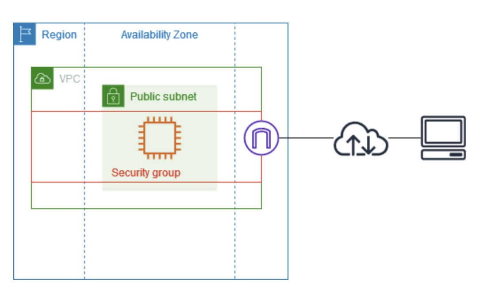

# テスト環境向け VPC 作成例
https://docs.aws.amazon.com/ja_jp/vpc/latest/userguide/vpc-example-dev-test.html

この例は、開発環境やテスト環境で使用する VPC の作成手順です。  
本番環境用ではないため、**単一のアベイラビリティーゾーン** にサーバーをデプロイしてコストと複雑さを抑えます。

---

## VPC の概要

- **アベイラビリティーゾーン**：1つ  
- **サブネット**：パブリックサブネット1つ  
- **インスタンス**：パブリックサブネット内の EC2  
- **セキュリティグループ**：SSH やアプリケーション用のトラフィックを許可  

**自分メモ**
```
# VPCとサブネットの整理

## VPC (Virtual Private Cloud)
- リージョン単位の論理ネットワーク
- 物理的なデータセンター単位ではなく、リージョン全体をカバーする仮想的なネットワークの箱
- 作成するときは **どのリージョンに作るかを指定**
→ VPCはリージョン単位で存在する論理ネットワーク なので、リージョンに紐づく

## サブネット (Subnet)
- AZ（アベイラビリティーゾーン）単位のネットワーク
- VPC内のサブネットは必ず **1つのAZ** に所属
- 複数AZにサブネットを作れば、VPC内で物理的に分散した構成が可能

## リソース（EC2など）
- サブネットに置かれるため、実質的には特定のAZに配置される
- VPC自体には物理的な存在はないが、リソースはAZに依存
```



### ルートテーブル例

| デスティネーション | ターゲット |
|------------------|------------|
| 10.0.0.0/16      | ローカル    |
| 2001:db8:1234:1a00::/56 | ローカル |
| 0.0.0.0/0        | igw-id      |
| ::/0              | igw-id      |

- **ローカル**：VPC 内の通信  
- **IGW**：インターネットへの通信


**自分メモ**
```
ローカル = VPC 内の通信
```

### セキュリティグループ例（インバウンド）

| ソース | プロトコル | ポート範囲 | 説明 |
|--------|-----------|-----------|------|
| 0.0.0.0/0 | TCP | 80  | IPv4 HTTP アクセス許可 |
| ::/0     | TCP | 80  | IPv6 HTTP アクセス許可 |
| 0.0.0.0/0 | TCP | 443 | IPv4 HTTPS アクセス許可 |
| ::/0     | TCP | 443 | IPv6 HTTPS アクセス許可 |
| 自ネットワークのパブリック IPv4 | TCP | 22 | IPv4 SSH（オプション） |
| 自ネットワークの IPv6 | TCP | 22 | IPv6 SSH（オプション） |
| 自ネットワークのパブリック IPv4 | TCP | 3389 | IPv4 RDP（オプション） |
| 自ネットワークの IPv6 | TCP | 3389 | IPv6 RDP（オプション） |

**自分メモ**
```
## 自ネットワークのパブリック IPv4 / IPv6 とは？
- 「自ネットワークのパブリック IPv4 / IPv6」は、**自分が使っているローカル環境のグローバルIPアドレス**を指す
  - 例：自宅や会社のネットワークのグローバルIP
- 設定すると、自分のローカルPCから以下の接続が可能になる
  - **SSH** (22番ポート)
  - **RDP** (3389番ポート)
- 「0.0.0.0/0」のように全世界に開くより、安全に自分のIPだけを許可できる

### ポイント
- 「自ネットワーク」と書かれている場合は、**特定のIPレンジのみアクセス許可する安全策**

## 自分のローカル環境のグローバルIPについて
- **多くの家庭用・一般オフィス回線は「動的IP」**
  - プロバイダーから自動的に割り当てられ、時間経過や再起動で変わることがある
- **固定IP（Static IP）**
  - 常に同じIPアドレスを使用可能
  - 企業向け回線や有料オプションで提供されることが多い

### VPCアクセスへの影響
- セキュリティグループで「自分のIPだけ許可」している場合
  - 動的IPだと、IPが変わるたびに設定を更新する必要がある

### 対策例
1. **固定IPを契約する**（簡単で安定）
2. **VPN経由で接続**（VPNサーバー側の固定IPを許可）
3. **0.0.0.0/0 で一時的にアクセスして、作業後に閉じる**（セキュリティリスク高い）
```

---

## VPC 作成手順

1. **VPC コンソールを開く**  
   https://console.aws.amazon.com/vpc/

2. **VPC を作成**  
   - [VPC を作成] → [VPC and more] を選択  
   - 名前タグを入力  
   - IPv4 CIDR ブロックを設定（デフォルトでも可）  
   - 必要に応じて IPv6 CIDR ブロックを追加

3. **サブネット設定**  
   - アベイラビリティーゾーン：1  
   - パブリックサブネット数：1  
   - プライベートサブネット数：0  
   - NAT ゲートウェイ：なし  
   - VPC エンドポイント：なし  
   - DNS オプション：両方有効（パブリック DNS 名を取得）

**自分メモ**
```
このVPCは 単一AZでパブリックサブネット1つのみ の構成
VPC自体はリージョン単位で存在
「AZ：1」と書かれているのは サブネットの配置先のAZ を指している
```

4. **作成**  
   - [Create VPC] を選択

---

## アプリケーションのデプロイ

- EC2 インスタンスを起動  
- インスタンスに接続して必要なソフトウェアをインストール  
- AMI を作成して保存  
- デプロイ方法例：  
  - EC2 インスタンス起動ウィザード  
  - Auto Scaling  
  - CloudFormation  
  - Amazon ECS

**自分メモ**
```
AMI (Amazon Machine Image) とは、AWSでEC2インスタンスを起動するための「テンプレート」
```
---

## 設定のテスト

- EC2 への接続確認  
- アプリケーションのトラフィック確認  
- Reachability Analyzer を使ってルートやセキュリティグループの問題をチェック

---

## クリーンアップ

- 不要になった VPC は削除可能  
- VPC 削除前に EC2 インスタンスを終了する


