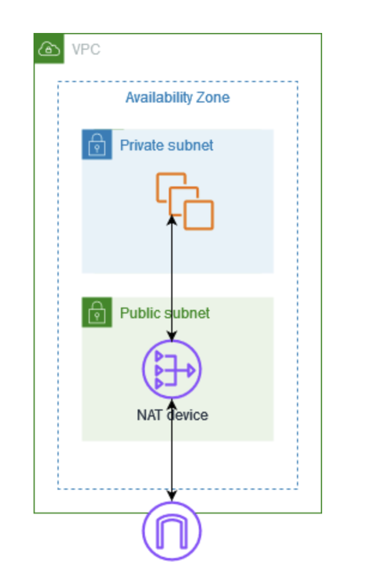

# NAT デバイスを使用してインターネットまたは他のネットワークに接続する
https://docs.aws.amazon.com/ja_jp/vpc/latest/userguide/vpc-nat.html

NAT デバイスを使用して、プライベートサブネット内のリソースによるインターネット、他の VPC、またはオンプレミスのネットワークへの接続を許可できます。これらのインスタンスは VPC 外のサービスと通信できますが、未承諾の接続リクエストを受信することはできません。

例えば、次の図は、プライベートサブネットの EC2 インスタンスがインターネットゲートウェイ経由でインターネットに接続できるようにするパブリックサブネットの NAT デバイスを示しています。NAT デバイスは、インスタンスの送信元 IPv4 アドレスを NAT デバイスのアドレスに置き換えます。インスタンスに応答トラフィックを送信するとき、NAT デバイスはアドレスを元の送信元 IPv4 アドレスに変換します。

NAT デバイスを使用すると、プライベートサブネット内の EC2 インスタンスがインターネットに接続できるようになります。

---

## 重要

- このドキュメントでは、一般的な IT 用語として NAT を使用していますが、NAT デバイスの実際の役割は **アドレス変換 (NAT)** と **ポートアドレス変換 (PAT)** の両方を兼ねます。
- AWS が提供する **NAT ゲートウェイ**（マネージド NAT デバイス）を使用することも、**NAT インスタンス**（EC2 インスタンスに独自の NAT デバイスを作成）を使用することも可能です。
- **NAT ゲートウェイ**を使用すると、可用性と帯域幅が向上し、管理の負担が軽減されるため、使用が推奨されます。

