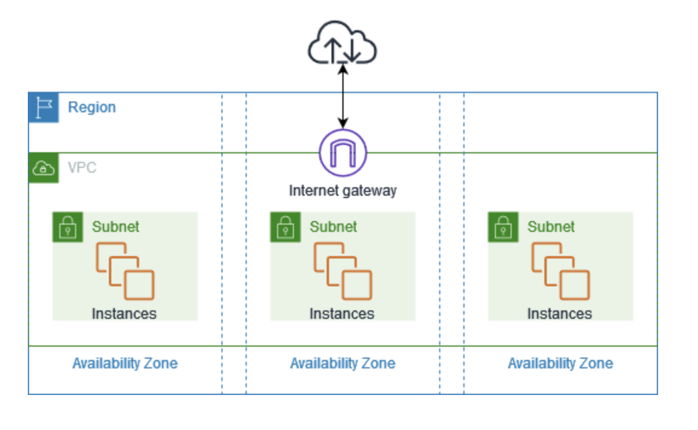

# Amazon VPC（Virtual Private Cloud）

Amazon VPC を使用すると、論理的に隔離された仮想ネットワーク内で AWS リソースを起動できます。  
VPC はお客様のデータセンターで運用されていた従来のネットワークに似ていますが、AWS のスケーラブルなインフラを利用できます。

次の図表は、VPC の例を示しています。VPC には、リージョンの各アベイラビリティーゾーンに 1 つのサブネット、各サブネットに EC2 インスタンス、VPC 内のリソースとインターネットとの通信を可能にするインターネットゲートウェイがあります。



---

## VPC の構成要素

-  **仮想プライベートクラウド (VPC)**  
VPC は、お客様自身のデータセンターで運用されている従来のネットワークによく似た仮想ネットワークです。  VPC の作成後、サブネットを追加できます。

- **サブネット**  
  VPC 内の IP アドレス範囲。1つのアベイラビリティゾーンに存在します。

- **IP アドレス**  
  - IPv4、IPv6 両方を使用可能  
  - EC2 インスタンス、NAT ゲートウェイ、Network Load Balancer などに割り当て可能

- **ルーティング**  
  ルートテーブルを使い、サブネットやゲートウェイへのトラフィック転送先を指定

- **ゲートウェイとエンドポイント**  
  - **インターネットゲートウェイ (IGW)**：VPC をインターネットに接続  
  - **VPC エンドポイント**：プライベートで AWS サービスに接続可能


**自分メモ**  
```
通常のアクセスパターン:
VPC → インターネットゲートウェイ → AWS サービス
- インターネット経由の通信になる  
- セキュリティ面で心配がある  

VPC エンドポイントを使用した場合:
- 通信は **AWS ネットワーク内部** で完結  
- **パブリック IP やインターネット** は不要  
- S3 や DynamoDB などのサービスに直接安全にアクセス可能
```

- **ピアリング接続**  
  2つの VPC 間でリソース通信を可能にする

- **トラフィックミラーリング**  
  ネットワークインターフェイスのトラフィックをコピーしてセキュリティ監視可能

- **Transit Gateway**  
  複数 VPC、VPN、Direct Connect 接続間のトラフィックを中央ハブでルーティング

- **VPC フローログ**  
  VPC のネットワークインターフェイスの IP トラフィックをキャプチャ

- **VPN 接続**  
  AWS VPN を使用してオンプレミスネットワークと接続可能

---

## Amazon VPC の開始方法

- AWS アカウントの各リージョンには **デフォルト VPC** があり、すぐに EC2 を起動可能
- 追加の VPC を作成してサブネット、IP アドレス、ゲートウェイ、ルーティングを設定可能

### 管理インターフェイス

- **AWS Management Console**：ウェブインターフェイス  
- **AWS CLI**：Windows, Mac, Linux 対応のコマンドラインツール  
- **AWS SDK**：プログラムから操作可能な言語別 API  
- **クエリ API**：低レベルの HTTPS リクエスト API

---

## Amazon VPC の料金

- **VPC 自体**：追加料金なし  
- **料金が発生する主なコンポーネント**：NAT ゲートウェイ、トラフィックミラーリング、IP Address Manager など

### IP アドレス

- **パブリック IPv4 アドレス**  
  - インターネットからアクセス可能  
  - AWS 無料利用枠では EC2 で 750 時間無料  
- **プライベート IPv4 アドレス**  
  - RFC 1918 に準拠、料金なし

### パブリック IPv4 アドレスの種類

- **Elastic IP アドレス (EIP)**：静的なパブリック IPv4  
- **EC2 パブリック IPv4**：EC2 に自動割り当て  
- **BYOIPv4**：自分の IP 範囲を持ち込む  
- **サービスマネージド IPv4**：AWS サービスにより自動管理される

### 主な対象サービス

- Amazon EC2  
- Elastic Load Balancing  
- Amazon RDS  
- Amazon EMR  
- Amazon EKS, ECS  
- AWS Client VPN  
- AWS Global Accelerator  
- その他多数

---

## 参考

- [Amazon VPC 公式ドキュメント](https://docs.aws.amazon.com/ja_jp/vpc/latest/userguide/what-is-amazon-vpc.html)
