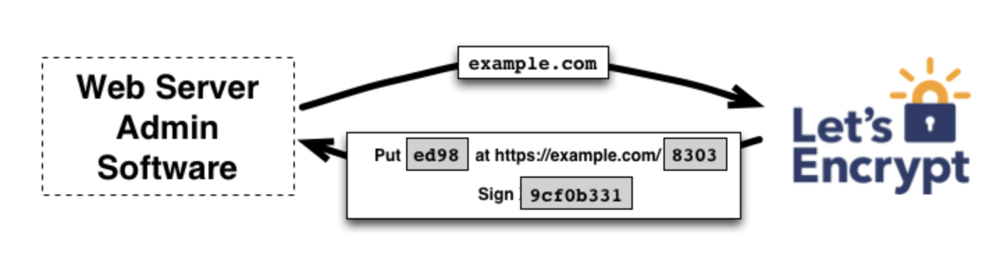
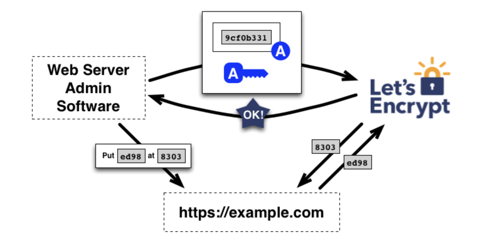
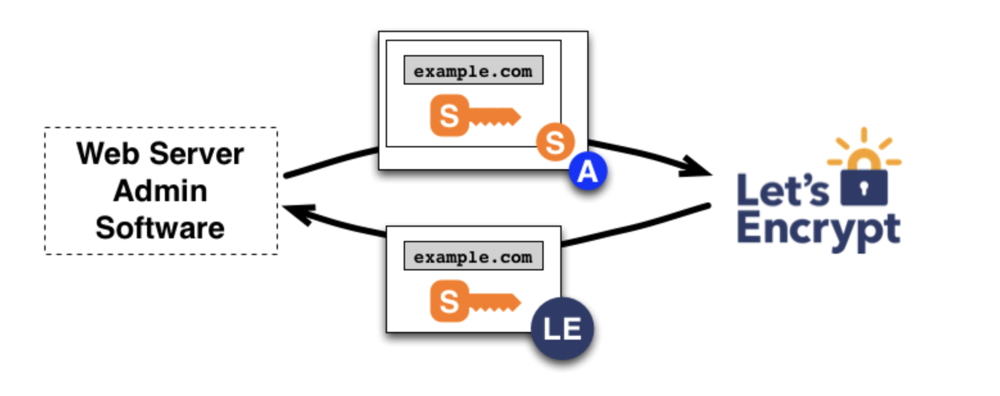
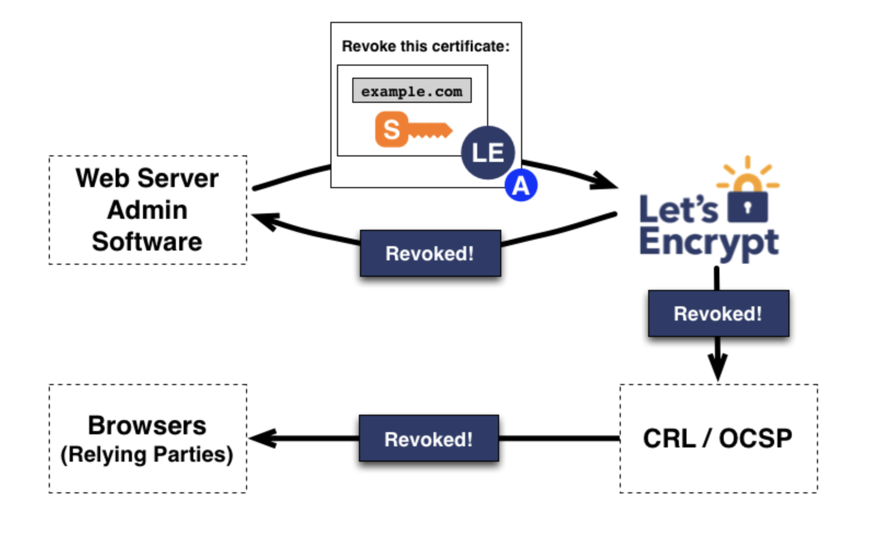

# 仕組み
最終更新日: 2025年8月2日

Let’s EncryptとACMEプロトコルの目的は、HTTPSサーバーを設定し、人間の介入なしにブラウザが信頼する証明書を自動的に取得できるようにすることです。  
これは、Webサーバー上でACMEクライアントを実行することで実現されます。

**自分メモ**  
```
Webサーバー上でACMEクライアントを実行する

ACME（Automatic Certificate Management Environment）   
ウェブサーバー（または管理者）と 認証局（CA） が通信して、
SSL/TLS証明書を自動的に発行・更新するための標準プロトコル
```

この技術の仕組みを理解するために、ACMEクライアントを用いたhttps://example.com/ の設定プロセスを順を追って説明します。

このプロセスには2つのステップがあります。  
まず、ACMEクライアントがウェブサーバーがドメインを管理していることを認証局（CA）に証明します。  
その後、クライアントはそのドメインの証明書を要求または失効させることができます。

```
「CA（Certificate Authority）」＝認証局  
```

# ドメイン検証
Let’s Encryptは公開鍵によってACMEクライアントソフトウェアを識別します。  
ACMEクライアントがLet’s Encryptと初めてやり取りする際、新しいアカウント鍵ペアを生成し、オペレーターが1つ以上のドメインを管理していることをLet’s Encrypt CAに証明します。  
これは従来のCAプロセスにおけるアカウント作成とドメイン追加に類似しています。

**自分メモ** 
```
オペレーター（operator）＝ACMEクライアントを操作・管理する人（あなた）
ACMEクライアント＝Let’s Encrypt と通信するソフトウェア
```

プロセスを開始するため、クライアントはexample.comの管理権限を証明するために必要な手順をLet’s Encrypt CAに問い合わせます。  

```
ステップ1:
sudo yum install certbot
sudo certbot certonly --standalone -d example.com
```

Let’s Encrypt CAは要求されたドメイン名を確認し、1つ以上の検証課題（チャレンジ）を発行します。  
クライアントがドメイン管理権限を証明する方法は複数あります。  
例えば、CAはクライアントに以下の選択肢を提示する場合があります：

 - example.com配下にDNSレコードをプロビジョニングする、または
- http://example.com/ 上の既知のURI下にHTTPリソースを配置する

**自分メモ**

```
プロビジョニング ＝ 必要な設定やリソースを自動で整えること
```
自分のプロジェクトでは以下で対応  
http://example.com/ 上の既知のURI下にHTTPリソースを配置する

| 項目 | あなたの環境での該当 |
|------|----------------|
| **使用したACMEクライアント** | Certbot |
| **使用したチャレンジ方式** | HTTP-01 |
| **nginx設定との関係** | 証明書発行後、nginxでその証明書を使用 |
| **/etc/letsencrypt/live/...** | Certbotが自動生成・更新する証明書と秘密鍵の保存場所 |



example.comを検証するためのチャレンジを要求する  
クライアントソフトウェアは提供された課題セットのいずれかを完了します。  
例えば上記2番目のタスクを達成できた場合、http://example.com サイト上の指定パスにファイルを作成します。  
クライアントがこれらの手順を完了すると、検証準備が整ったことをCAに通知します。
```
ステップ2: 1つ以上の検証課題（チャレンジ）を発行
ステップ3: クライアントソフトウェアは提供された課題セット
```
その後、複数のネットワーク観点から課題が満たされていることを確認するのがCAの役割です。

```
ステップ4:
Let’s Encrypt（CA）が HTTP アクセスで、課題が満たされていることを確認する
```



example.com に対する操作権限の要求  
チャレンジが正常に確認されれば、公開鍵で識別されたクライアントは example.com の証明書管理を行う権限を付与されます。

このプロセスは HTTPS を使用できないため、特定の攻撃に対して脆弱です。  
この問題を軽減するため、Let's Encrypt は実際には異なるネットワーク視点から複数の検証を並行して実行します。  
これにより、攻撃者が検証プロセスを妨害する成功率が大幅に低下します。

# 証明書の発行と失効
クライアントが認証されると、証明書の要求・更新・失効は単純化されます。  
認証済みアカウントの鍵ペアで署名した証明書管理メッセージを送信するだけです。

### 発行
ドメインの証明書を取得するため、クライアントはPKCS#10証明書署名要求（CSR）を作成します。  
これはLet’s Encrypt認証局に対し、指定された公開鍵を持つexample.comの証明書発行を要求するものです。  
通常通り、CSRにはCSR内の公開鍵に対応する秘密鍵による署名が含まれます。  
クライアントはまた、example.comの認証済み鍵でCSR全体に署名し、Let’s Encrypt CAが認証済みであることを認識できるようにします。

Let’s Encrypt CAがリクエストを受信すると、両方の署名を検証します。  
問題がなければ、CSRの公開鍵を用いたexample.comの証明書を発行し、クライアントに返却します。CAはさらに、この証明書を多数の公開Certificate Transparency（CT）ログに提出します。  
詳細はここを参照してください。
```
ステップ 5：証明書の発行と保存
```



example.comの証明書要求
後日の証明書更新は、発行プロセスを再度繰り返すことを意味します。  
つまり、ドメイン検証を実行し、新しい証明書を要求します。

### 失効処理
失効処理も同様の仕組みで動作します。  
クライアントはexample.comで認証されたアカウント鍵ペアで失効リクエストに署名し、Let’s Encrypt CAはリクエストが正当なものであることを検証します。  
正当性が確認されると、失効情報を証明書失効リスト（CRL）を通じて公開します。  
これにより、ブラウザなどの信頼当事者は失効した証明書を受け入れてはならないことを認識できます。





**自分メモ**
## 🔐 HTTP-01 チャレンジの流れ

---

### 🩵 ステップ 1：Certbot（ACMEクライアント）が Let’s Encrypt に申請

あなた（オペレーター）が次を実行：

```bash
sudo certbot certonly --standalone -d example.com
Certbot は Let’s Encrypt（ACMEサーバー）に次のようなリクエストを送ります：
```
「私は example.com の証明書をください」

🩵 ステップ 2：Let’s Encrypt が「チャレンジ」を発行
Let’s Encrypt は Certbot に次のように伝えます：

OK、あなたが example.com を管理していることを証明してください。
次のURLにこのトークンを配置してね：

```
http://example.com/.well-known/acme-challenge/<TOKEN>
```
そして Let’s Encrypt は「正しい応答内容（KEY_AUTHORIZATION）」を指定します。
（これは乱数のような長い文字列です）

🩵 ステップ 3：Certbot が一時サーバーを起動し、トークンを配置
--standalone オプションを使っているため、
Certbot 自身が一時的な Web サーバーをポート 80 で起動します。

そのサーバーは：

```
/.well-known/acme-challenge/<TOKEN>
```
という URL にアクセスされたときに、
Let’s Encrypt から指定されたトークンを返すように動作します。

🩵 ステップ 4：Let’s Encrypt（CA）が HTTP アクセスで確認
Let’s Encrypt は外部からインターネット越しに次のリクエストを送ります：
```
nginx
GET http://example.com/.well-known/acme-challenge/<TOKEN>
```
サーバー（Certbot の一時 Web サーバー）が
正しいトークン文字列を返せば、CA はこう判断します：

✅ 「この人は確かに example.com の HTTP サーバーをコントロールしている」
→ 証明書を発行しても安全だ

🩵 ステップ 5：証明書の発行と保存
認証が成功すると、Let’s Encrypt は証明書を発行し、
Certbot が次の場所に保存します：
```
/etc/letsencrypt/live/example.com/fullchain.pem
/etc/letsencrypt/live/example.com/privkey.pem
```
その後、nginx でこれらを読み込む設定を行うことで HTTPS が有効になります。


```
┌────────────────────────┐
│   あなた（Certbot）     │
│  $ certbot certonly ... │
└──────────┬─────────────┘
           │ ① 証明書申請
           ▼
┌────────────────────────┐
│ Let's Encrypt (CA)     │
│ 「このURLにトークン置いて」│
└──────────┬─────────────┘
           │ ② 指示を受け取る
           ▼
┌────────────────────────┐
│ Certbot（standalone）    │
│ 一時Webサーバー起動     │
│ .well-known/... に配置   │
└──────────┬─────────────┘
           │ ③ HTTP確認
           ▼
┌────────────────────────┐
│ Let's Encrypt (CA)     │
│ トークン確認 → OKなら発行 │
└──────────┬─────────────┘
           │ ④ 証明書発行
           ▼
/etc/letsencrypt/live/example.com/
    ├── fullchain.pem
    └── privkey.pem
```

### 自分のプロジェクトで使用したコマンド
```
$ sudo yum install certbot

$ sudo certbot certonly --standalone -d sample-web.com
Saving debug log to /var/log/letsencrypt/letsencrypt.log

Enter email address (used for urgent renewal and security notices)
 (Enter 'c' to cancel): sample@gmail.com

$ less /etc/letsencrypt/live/sample-web.com/fullchain.pem
```


```
// nginx.conf

// Let's Encryptで取得したSSL証明書と秘密鍵のパスを指定
ssl_certificate /etc/letsencrypt/live/sample-web.com/fullchain.pem;
ssl_certificate_key /etc/letsencrypt/live/sample-web.com/privkey.pem;
```
