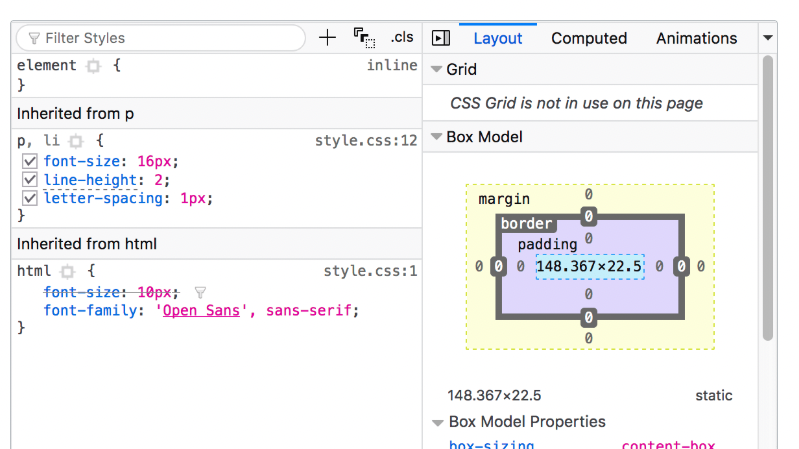

# ブラウザーの開発者ツールとは

[MDN: ブラウザーの開発者ツールとは](https://developer.mozilla.org/ja/docs/Learn_web_development/Howto/Tools_and_setup/What_are_browser_developer_tools)

# CSS エディターについて

ブラウザー開発者ツールの CSS エディターは、HTML エディターで選択中の要素に適用されている CSS ルールを表示する。  
隣接してレイアウトパネルもあり、選択された要素のボックスモデルプロパティを表示する。

---

## 主な機能

- 適用されている CSS ルールは詳細度の高い順に表示
- 宣言の隣にあるチェックボックスをクリックして、無効化したときの見た目を確認できる
- 一括指定プロパティの隣の矢印を開くと、個別指定プロパティの現在値が確認できる
- プロパティ名や値をクリックすると編集可能なテキストボックスが表示され、見た目を即座にプレビュー可能
- 宣言の隣には、その宣言が書かれているファイル名と行数が表示され、クリックすると開発ツールでジャンプ・編集・保存が可能
- 閉じ中括弧をクリックすると、新しいルールを追加するためのテキストボックスが表示される

---

## タブメニュー

- **計算済み**: ブラウザーが計算した、選択中の要素に適用されている設定値を表示
- **レイアウト**: CSS グリッドやフレックスボックスレイアウトの詳細を表示
- **フォント**: 現在選択中の要素のフォント設定を表示（Firefox）
- **ボックスモデルビュー**: パディング、境界線、マージン、コンテンツの大きさを視覚的に表示
  - Firefox: 「レイアウト」タブに表示
  - 他ブラウザー: 「計算済み」タブに表示

---

## その他の情報

- 一部ブラウザーでは選択した要素の JavaScript の詳細も表示
  - Safari: 「ノード」タブに統合
  - Chrome / Opera / Edge: 別々のタブで表示
- **プロパティ**: その要素オブジェクトのプロパティ
- **イベントリスナー**: その要素に関連付けられたイベント

