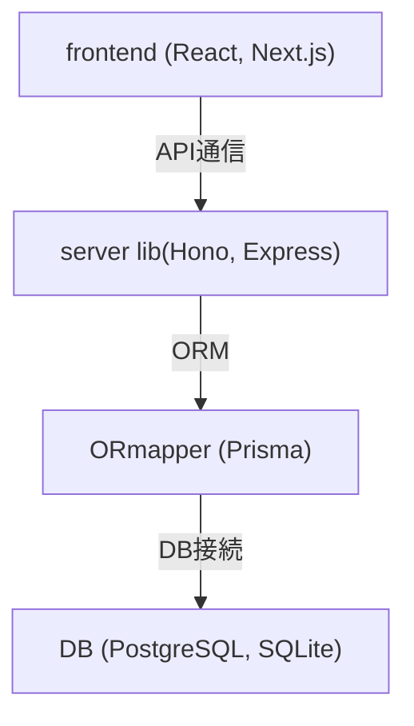
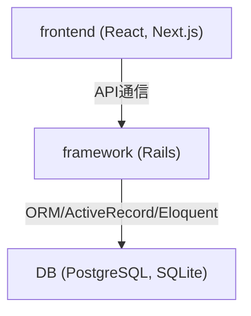
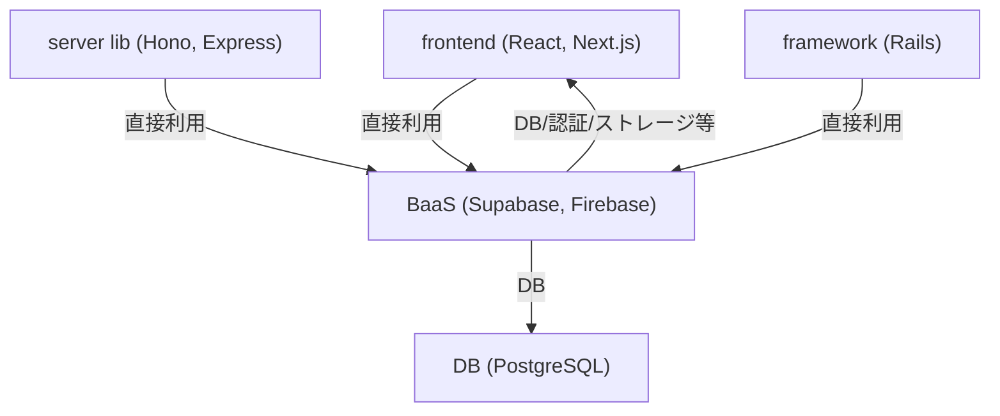
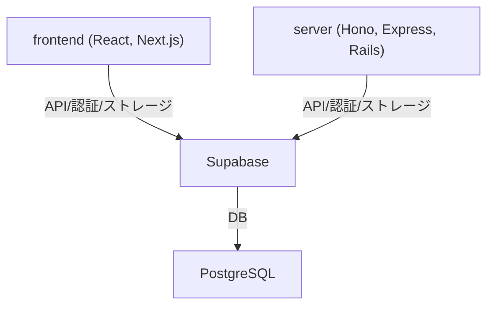

# 技術スタックまとめ

## フレームワーク

- Ruby on Rails
- Laravel
- Next.js（フロントエンド）

## サーバーサイドライブラリ

- Hono
- Express

## OR マッパー

- Prisma

## フロントエンドライブラリ

- React

## 言語

- Ruby
- JavaScript
- TypeScript

## インフラ

### ホスティング

- Firebase

### データベース

- SQLite
- PostgreSQL

### Backend as a Service

- Supabase
  認証（Auth）
  ストレージ（ファイル管理）
  Edge Functions（サーバーレス関数）
  リアルタイム通信
  REST/GraphQL API 自動生成
  管理ダッシュボード

---

### Unicorn, Nginx, リバースプロキシまとめ

■ Unicorn

- Ruby（特に Rails）用のアプリケーションサーバ。
- HTTP リクエストの受付・プロセス管理・並列処理を担う。
- Express や Hono（Node.js 系）では不要。Node.js は自身が HTTP サーバとして動作するため、PM2 や forever などのプロセスマネージャを使うのが一般的。

■ Nginx

- Web サーバやリバースプロキシとして利用。
- 主な用途：
  - SSL 終端（HTTPS 対応）
  - リバースプロキシ（複数アプリサーバへの振り分け）
  - 静的ファイル配信
  - ロードバランサや WAF 的な役割
  - アクセス制御や BASIC 認証
  - キャッシュや圧縮による高速化

■ リバースプロキシ

- クライアントからのリクエストを一度受け取り、裏側のアプリケーションサーバに転送する中継役。
- 主な役割：
  - サーバ構成の隠蔽
  - 負荷分散
  - SSL 終端
  - キャッシュ・圧縮
  - セキュリティ強化

## AWS EC2 で nginx を使う基本手順

1. **EC2 インスタンスを作成**
   - Amazon Linux, Ubuntu などの OS を選択
2. **nginx をインストール**
   - yum, apt などのパッケージマネージャを使用
3. **nginx の設定ファイルを編集**
   - 通常 `/etc/nginx/nginx.conf` や `/etc/nginx/conf.d/` に設定を書く
4. **プロジェクトの静的ファイルやリバースプロキシ先を指定**
   - Express, Rails などのアプリケーションサーバへの転送設定
5. **nginx を起動・再起動**
   - `systemctl restart nginx` などでサービスを管理

> nginx の設定はプロジェクトディレクトリ内ではなく、EC2 の nginx 設定ディレクトリに書くのが一般的です。
> （ただし、プロジェクト内に nginx 用の設定ファイルテンプレートを置いておくことはあります）

## AWS EC2 上での Rails プロジェクトと nginx の関係まとめ

- EC2 インスタンスは仮想サーバであり、中に Linux OS が動作している
- Linux OS 上に、Rails プロジェクトのディレクトリ（例: `/home/ec2-user/myapp`）が存在する
- どのディレクトリにいても、nginx のインストールコマンド（`sudo yum install nginx` など）を実行すれば、
  - Linux OS の標準ディレクトリ（`/etc/nginx/` など）に nginx 関連のファイルやディレクトリが自動で作成される
- EC2 インスタンスの中には、
  - Linux OS
  - プロジェクトディレクトリ
  - nginx（`/etc/nginx/` など）
    が共存している

> nginx の設定ファイルは通常 `/etc/nginx/` 配下に置かれるが、プロジェクト内にテンプレートとして置いておくことも可能
