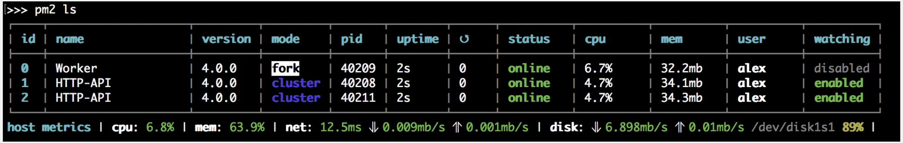
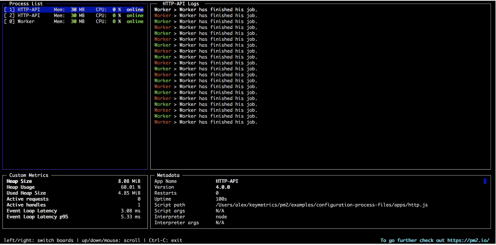
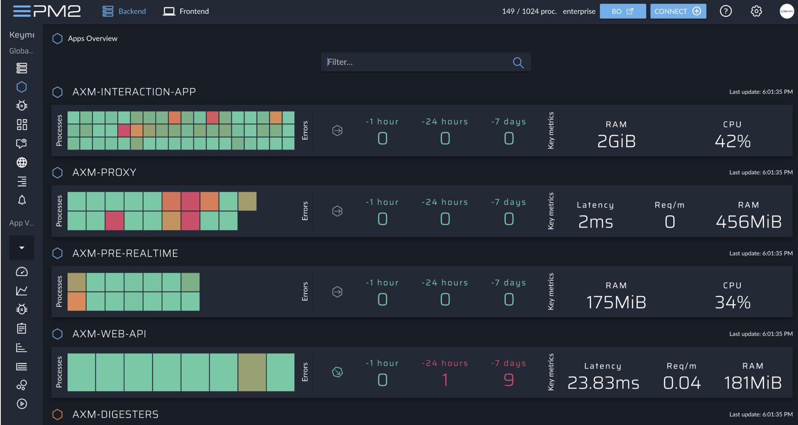

👇
🧩 PM2 プロセスマネジメント クイックスタート  
https://pm2.keymetrics.io/docs/usage/quick-start/

PM2 は、アプリケーションを管理し、常にオンライン状態を維持するための デーモンプロセスマネージャー です。
セットアップは簡単で、直感的な CLI（コマンドラインインターフェース） として提供され、NPMからインストールできます。

🚀 インストール

最新の PM2 バージョンは NPM または Yarn からインストールできます。
```
$ npm install pm2@latest -g

# または

$ yarn global add pm2
```


Node.js と NPM をまだインストールしていない場合は、NVM（Node Version Manager） を使って導入できます。

▶️ アプリの起動

最も簡単な方法でアプリをデーモン化（バックグラウンド実行）して監視するには次のコマンドを使います：
```
$ pm2 start app.js
```

他のアプリケーションも簡単に起動できます：
```
$ pm2 start bashscript.sh
$ pm2 start python-app.py --watch
$ pm2 start binary-file -- --port 1520
```

CLI に渡せる主なオプションは次の通りです：
```
--name <app_name>            # アプリ名を指定
--watch                      # ファイル変更時に再起動
--max-memory-restart <200MB> # メモリ使用量の閾値で再起動
--log <log_path>             # ログファイルを指定
-- arg1 arg2 arg3            # スクリプトに引数を渡す
--restart-delay <ms>         # 自動再起動の間隔を設定
--time                       # ログに時刻を付与
--no-autorestart             # 自動再起動を無効化
--cron <cron_pattern>        # 定期的に再起動するCron設定
--no-daemon                  # デーモン化せずログに接続
```

このように、多くのオプションを使ってアプリケーションを柔軟に管理できます。


## 🧩 自分メモ　コマンド構造の説明

```bash
pm2 start npm --name api-server -- run server
```

| 部分 | 意味 |
|------|------|
| `pm2 start` | PM2で新しいプロセスを起動するコマンド |
| `npm` | 実行するコマンド。ここでは Node.js のパッケージマネージャー npm |
| `--name api-server` | PM2上でこのプロセスに「api-server」という名前をつける（管理しやすくなる） |
| `--` | これ以降は npm に渡す引数という意味（PM2とnpmの引数を区別するための区切り） |
| `run server` | npm に「run server」を実行させる。つまり `npm run server` と同じ意味 |


---


⚙️ プロセス管理

アプリの状態を管理するのは簡単です。主なコマンド：
```
$ pm2 restart app_name
$ pm2 reload app_name
$ pm2 stop app_name
$ pm2 delete app_name
```

app_name の代わりに以下も使用可能：

- all：すべてのプロセスに対して実行
- id：特定のプロセスIDに対して実行

📊 ステータス・ログ・メトリクスの確認

アプリを起動したら、ステータスやログ、メトリクスを確認したり、
オンラインダッシュボード（pm2.io）を利用できます。

管理中アプリ一覧の表示
```
$ pm2 [list|ls|status]
```


## 🧩 自分メモ　　npm list

| id | name        | namespace | version | mode  | pid    | uptime | ↺ | status  | cpu | mem     | user     | watching |
|----|--------------|------------|----------|--------|--------|--------|---|----------|-----|---------|-----------|-----------|
| 0  | api-server   | default    | N/A      | fork   | 123456 | 2D     | 0 | online  | 0%  | 59.0mb | sample-user | enabled または disabled |


| 項目 | 意味 |
|------|------|
| **id** | PM2が割り当てたプロセスのID。再起動・停止などで指定できる（例：`pm2 restart 0`）。 |
| **name** | プロセス名（`--name`で指定したもの）。ここでは `api-server`。 |
| **namespace** | 名前空間（複数環境をグループ分けするときに使う）。デフォルトは `default`。 |
| **version** | 実行中アプリのバージョン（`package.json` の `version`）。ここでは `N/A`（検出されなかった）。 |
| **mode** | 実行モード。`fork` は単一プロセス実行、`cluster` はクラスターモード（CPUコアごとに複数プロセス）。 |
| **pid** | OS上のプロセスID。実際に動作している Node.js のプロセス番号。 |
| **uptime** | 起動からの稼働時間。ここでは「2日間」。 |
| **↺（restarts）** | PM2が自動または手動で再起動した回数。ここでは「0回」。 |
| **status** | 現在の状態。主な値：`online`（稼働中）、`stopped`（停止）、`errored`（エラー）。 |
| **cpu** | 現在のCPU使用率。`0%` は負荷がほぼない状態。 |
| **mem** | メモリ使用量。ここでは `59.0mb`。 |
| **user** | プロセスを実行しているユーザー。ここでは `sample-user `（AWS上のEC2ユーザー）。 |
| **watching** | ファイル変更監視機能の状態。`enabled` なら `--watch` オプションが有効。

--

リアルタイムログ表示
```
$ pm2 logs
```
過去ログの確認
```
$ pm2 logs --lines 200
```




💻 ターミナルダッシュボード

リアルタイムで監視できるターミナル用ダッシュボード：
```
$ pm2 monit
```
🌐 pm2.io：Webベースの監視＆診断ダッシュボード

Web上で複数サーバーを横断してアプリの監視・診断ができます。
```
$ pm2 plus
```



⚖️ クラスターモード（Node.js向け）

PM2はNode.jsアプリ用に自動ロードバランサーを備えており、
HTTP/HTTPS/WebSocket/TCP/UDP の接続を各プロセスに分散します。
```
$ pm2 start app.js -i max
```
🗂️ Ecosystemファイル（設定ファイル）

複数アプリをまとめて管理するには、Ecosystem File を使います。

生成コマンド：
```
$ pm2 ecosystem
```

生成される ecosystem.config.js の例：
```
module.exports = {
  apps : [{
    name: "app",
    script: "./app.js",
    env: {
      NODE_ENV: "development",
    },
    env_production: {
      NODE_ENV: "production",
    }
  }, {
     name: 'worker',
     script: 'worker.js'
  }]
}
```

起動は以下のように簡単です：
```
$ pm2 start ecosystem.config.js
```
🔁 起動時の自動再起動設定

サーバー再起動後に PM2 が自動でアプリを復旧させるには：
```
$ pm2 startup
```

現在のプロセスリストを保存して再起動時に復元するには：
```
$ pm2 save
```
👀 ファイル変更で自動再起動

ファイル変更を監視して自動再起動するには：
```
$ cd /path/to/my/app
$ pm2 start env.js --watch --ignore-watch="node_modules"
```

node_modules の変更を無視しつつ、他のファイル変更時に再起動します。
再起動のログは pm2 logs で確認できます。

⬆️ PM2のアップデート

PM2のアップデート手順は非常に簡単です：
```
npm install pm2@latest -g
pm2 update
```
🧠 チートシート（よく使うコマンド）  

🔹 モード
```
pm2 start app.js --name my-api   # プロセス名を指定
pm2 start app.js -i 0            # CPU数に応じて最大プロセス数で起動
pm2 scale app +3                 # 3プロセス追加
pm2 scale app 2                  # 合計2プロセスに調整
```

🔹 一覧・情報表示
```
pm2 list               # 全プロセスの一覧
pm2 jlist              # JSON形式で出力
pm2 prettylist         # 整形済みJSONで出力
pm2 describe 0         # 特定のプロセス情報を表示
pm2 monit              # 監視ダッシュボードを表示
```

🔹 ログ管理
```
pm2 logs [--raw]       # 全プロセスのログをリアルタイム表示
pm2 flush              # ログファイルを全削除
pm2 reloadLogs         # ログファイルを再読み込み
```

🔹 アクション
```
pm2 stop all           # すべて停止
pm2 restart all        # すべて再起動
pm2 reload all         # ネットワークアプリ向けのゼロダウンタイム再起動
pm2 stop 0             # ID指定停止
pm2 restart 0          # ID指定再起動
pm2 delete 0           # ID指定削除
pm2 delete all         # 全削除
```

🔹 その他
```
pm2 reset <process>    # メタデータリセット
pm2 updatePM2          # PM2のメモリ更新
pm2 ping               # PM2デーモンが動作中か確認
pm2 sendSignal SIGUSR2 my-app # シグナル送信
pm2 start app.js --no-daemon
pm2 start app.js --no-vizion
pm2 start app.js --no-autorestart
```

📚 次に学ぶべきこと

- JSON設定ファイルでアプリの動作を定義する方法

- クリーンな停止・再起動で信頼性を上げる方法

- 本番アプリを簡単にデプロイ・更新する方法

- PM2.io で本番アプリを監視・診断する方法

🔄 PM2 の更新方法（まとめ）
```
npm install pm2@latest -g
pm2 update
```


