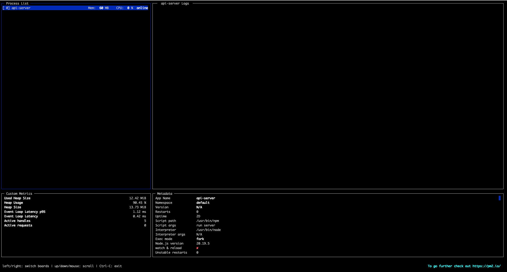

## 🧩 自分メモ　コマンド構造の説明

```bash
pm2 start npm --name api-server -- run server
```

| 部分 | 意味 |
|------|------|
| `pm2 start` | PM2で新しいプロセスを起動するコマンド |
| `npm` | 実行するコマンド。ここでは Node.js のパッケージマネージャー npm |
| `--name api-server` | PM2上でこのプロセスに「api-server」という名前をつける（管理しやすくなる） |
| `--` | これ以降は npm に渡す引数という意味（PM2とnpmの引数を区別するための区切り） |
| `run server` | npm に「run server」を実行させる。つまり `npm run server` と同じ意味 |


## 🧩 npm list

| id | name        | namespace | version | mode  | pid    | uptime | ↺ | status  | cpu | mem     | user     | watching |
|----|--------------|------------|----------|--------|--------|--------|---|----------|-----|---------|-----------|-----------|
| 0  | api-server   | default    | N/A      | fork   | 123456 | 2D     | 0 | online  | 0%  | 59.0mb | sample-user | enabled または disabled |


# PM2 チートシート（PM2の実運用で覚えておくべき項目）


## 1. 基本操作
```bash
# アプリ単体
pm2 start app.js
pm2 stop app.js
pm2 restart app.js
pm2 delete app.js

# 設定ファイルで複数アプリを管理
pm2 start ecosystem.config.js
pm2 stop ecosystem.config.js
pm2 restart ecosystem.config.js
pm2 delete ecosystem.config.js
```

## 2. プロセス管理
name / id：アプリ識別用

instances：CPUに合わせて複数プロセス起動（クラスタモード）

exec_mode：fork（単一） / cluster（マルチ）


```js
module.exports = {
  apps: [{
    name: "api-app",
    script: "./api.js",
    instances: 4,
    exec_mode: "cluster"
  }]
}
```

## 3. 再起動関連
- autorestart：落ちたら自動再起動

- max_restarts：短時間での再起動回数制限

- restart_delay：再起動前の待機時間（ms）

- cron_restart：定期再起動（cron形式）

- watch / ignore_watch：コード変更時の自動再起動

js
```
watch: true,
ignore_watch: ["node_modules", "logs"],
autorestart: true,
restart_delay: 3000,
max_restarts: 10,
cron_restart: "0 0 * * *"
```

## 4. ログ管理
- out_file / error_file：出力先指定

- merge_logs：クラスタモードでログを1ファイルにまとめる

- log_date_format：ログに日付フォーマット

- pm2 logs：リアルタイムログ確認

- pm2 flush：ログのクリア

bash
```
pm2 logs                 # 全アプリのログ
pm2 logs api-app         # 特定アプリのログ
pm2 flush                # 全アプリのログクリア
pm2 flush api-app        # 特定アプリのログクリア
```

## 5. 環境切替
env / env_production / env_development

起動時に --env <envname> で切り替え

js
```
env: { NODE_ENV: "development" },
env_production: { NODE_ENV: "production" }
```

bash
```
pm2 start ecosystem.config.js --env production
pm2 restart ecosystem.config.js --env development
```

## 6. 永続化（サーバ再起動後も自動起動）
bash
```
pm2 startup              # 起動スクリプト生成
sudo su -c "..."         # root権限で実行（提示されるコマンド）
pm2 save                 # 起動中のアプリを保存
pm2 resurrect            # 保存済みアプリを手動で復元
pm2 unstartup            # 自動起動設定を解除
```

## 7. おすすめ運用ポイント
- 最初は 「起動・停止・再起動」と「ログ確認」 だけ覚える
- 慣れたら クラスタモード、watch、自動再起動、永続化 を追加
- ログは必ず残す（障害調査のため）
- 開発環境と本番環境は --env で切り替え


# PM2 による CPU / メモリ監視

https://pm2.keymetrics.io/docs/usage/monitoring/  

1. PM2 Monit

ターミナルから簡単にアプリの CPU とメモリ使用量 を監視可能
```
pm2 monit
```

2. PM2.io
- 複数サーバーで動く Node.js アプリを Web ダッシュボードで監視・管理
- リアルタイムでリソース使用状況やアプリ状態を確認できる
- PM2.io でより簡単に監視・管理が可能

3. メモリ閾値での自動リロード
- アプリが設定した メモリ上限 を超えると自動でリロード（再起動にフォールバック）
- 内部チェックは 30秒ごと に行われるため、即時反応ではない




