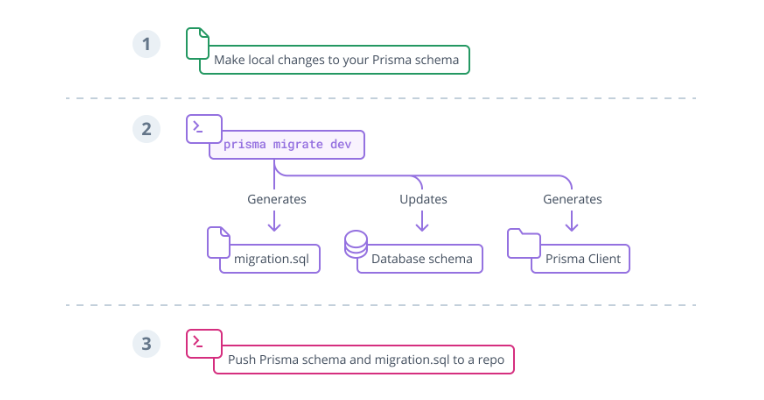

# What is Prisma ORM?（Prisma ORM とは？）
Prisma / docs  
https://www.prisma.io/docs/orm/overview/introduction/what-is-prisma

**Prisma ORM** は、オープンソースの次世代 ORM（Object Relational Mapper）です。  
以下の主要なコンポーネントで構成されています。

- **Prisma Client**：Node.js と TypeScript 向けの、自動生成される型安全なクエリビルダー  
- **Prisma Migrate**：データベースマイグレーションシステム  
- **Prisma Studio**：データベース内のデータを閲覧・編集できる GUI ツール  

> 💡 **補足**
> Prisma Studio は Prisma ORM の中で唯一オープンソースではありません。  
> ローカル環境でのみ実行できます。

**Prisma Client** は、任意の Node.js（サポートバージョン）または TypeScript のバックエンドアプリケーションで使用可能です。  
REST API、GraphQL API、gRPC API など、データベースを扱うあらゆるアプリケーションで利用できます。

---

## How does Prisma ORM work?（Prisma ORM の仕組み）

### Prisma スキーマとは

Prisma ORM のツール群を使用するすべてのプロジェクトは、**Prisma スキーマファイル**から始まります。  
このスキーマでは、アプリケーションのモデルを直感的に定義し、  
使用するデータベースおよびクライアント生成設定を含めます。

---

### Prisma スキーマの例

```prisma
datasource db {
  provider = "postgresql"
  url      = env("DATABASE_URL")
}

generator client {
  provider = "prisma-client-js"
}

model Post {
  id        Int     @id @default(autoincrement())
  title     String
  content   String?
  published Boolean @default(false)
  author    User?   @relation(fields: [authorId], references: [id])
  authorId  Int?
}

model User {
  id    Int     @id @default(autoincrement())
  email String  @unique
  name  String?
  posts Post[]
}
```

# Prisma スキーマのデータモデリング機能

> 💡 **注記**  
> Prisma スキーマは強力なデータモデリング機能を備えています。  
> 例えば、「**Prisma レベル**」でリレーションフィールドを定義でき、  
> Prisma Client API でリレーションをより簡単に扱えるようになります。  
> 
> 上記の例では、`User` モデルの `posts` フィールドは  
> 「Prisma レベル」でのみ定義されており、  
> 実際のデータベースには外部キーとして存在しません。


**自分用メモ:**  
- DBでの設定を補完して、外部キーをPrismaで設定できる

---

## Prisma スキーマで設定する3つの要素

1. **Data source（データソース）**  
   環境変数を使ってデータベース接続を指定します。  
   例：`url = env("DATABASE_URL")`

2. **Generator（ジェネレーター）**  
   Prisma Client を生成する設定を指定します。  
   例：`provider = "prisma-client-js"`

3. **Data model（データモデル）**  
   アプリケーションで使用するモデル（テーブルやコレクション）を定義します。

---

## Prisma スキーマのデータモデル

このページでは特に **データモデル** に焦点を当てます。  
Data sources や Generators については、それぞれの専用ドキュメントを参照してください。

---

### データモデルの役割

Prisma スキーマのデータモデルは、複数の `model` 定義の集合です。  
各モデルには次の2つの主要な機能があります。

1. **リレーショナルデータベースではテーブル、MongoDB ではコレクションを表現する**  
2. **Prisma Client API で実行されるクエリの基盤を提供する**

---

## データモデルの取得方法（Getting a data model）

Prisma スキーマにデータモデルを取り込む方法は主に2つあります。

1. **Prisma Migrate を使ってデータモデルを手動で定義し、データベースにマッピングする**
2. **既存のデータベースをイントロスペクション（構造読み取り）して自動的に生成する**

---

### データモデル定義後の流れ

データモデルを定義すると、**Prisma Client** を生成できます。  
生成された Prisma Client は、定義済みのモデルに対して CRUD 操作などのクエリを提供します。

TypeScript を使用している場合、  
**すべてのクエリに型安全性（type-safety）** が適用され、  
特定のフィールドのみを取得する場合でも型が保証されます。


## Prisma Client を使ってデータベースにアクセスする

### Prisma Client の生成

Prisma Client を使用するための最初のステップは、**@prisma/client** と **prisma** の npm パッケージをインストールすることです。

```bash
npm install prisma --save-dev
npm install @prisma/client
```

**自分用メモ:**  
--save-dev は npm（Node.jsのパッケージマネージャー） のオプションで、開発時にだけ必要なパッケージ としてインストールすること


その後、次のコマンドを実行して Prisma Client を生成します：

```bash
npx prisma generate
```

## データモデル変更後の Prisma Client 再生成

データモデルを変更した後は、以下のコマンドを実行して Prisma Client を手動で再生成し、  
`node_modules/.prisma/client` 内のコードを最新状態に保ちます。

```bash
npx prisma generate
```

```ts
// モジュールのインポート方法
// ES Modules を使用する場合
import { PrismaClient } from '@prisma/client'

// CommonJS を使用する場合
const { PrismaClient } = require('@prisma/client')

// Prisma Client のインスタンス化
const prisma = new PrismaClient()
```
これで、生成された Prisma Client API を使ってデータベースにクエリを送信できます。
以下にいくつかのサンプルクエリがあります。
すべての Prisma Client クエリは 通常の JavaScript オブジェクト を返します。

詳細な操作方法は、Prisma Client API リファレンス を参照してください。

## データベースからのデータ取得・操作のサンプル

以下は、Prisma Client を使ったサンプルクエリです。  
すべてのクエリは `async` 関数内で実行してください。

---

### 1. User レコードをすべて取得

```ts
const allUsers = await prisma.user.findMany()
```

2. User レコードに関連する posts を含めて取得
```ts
const allUsers = await prisma.user.findMany({
  include: { posts: true },
})
```

3. "prisma" を含む Post レコードをフィルター
```ts
const filteredPosts = await prisma.post.findMany({
  where: {
    OR: [
      { title: { contains: 'prisma' } },
      { content: { contains: 'prisma' } },
    ],
  },
})
```

4. 新しい User と Post を同時に作成
```ts
const user = await prisma.user.create({
  data: {
    name: 'Alice',
    email: 'alice@prisma.io',
    posts: {
      create: { title: 'Join us for Prisma Day 2020' },
    },
  },
})
```

5. 既存の Post を更新
```ts
const post = await prisma.post.update({
  where: { id: 42 },
  data: { published: true },
})
```

TypeScript での使用  
TypeScript を使用する場合、これらのクエリ結果は 静的型付け されます。
存在しないプロパティにアクセスしたり、タイプミスをした場合、コンパイル時に検出されます。

詳細はドキュメントの Advanced usage of generated types を参照してください。


## Typical Prisma ORM Workflows（典型的な Prisma ORM のワークフロー）

前述の通り、Prisma スキーマにデータモデルを取り込む方法は主に2つあります。  
どの方法を選ぶかによって、Prisma ORM のワークフローは異なります。

---

### ① Prisma Migrate を使用する場合

**Prisma Migrate** は、Prisma ORM に統合されたデータベースマイグレーションツールです。  
この場合の典型的なワークフローは次の通りです：

1. Prisma スキーマのデータモデルを手動で調整する  
https://www.prisma.io/docs/orm/prisma-schema/data-model/models
2. `prisma migrate dev` コマンドを使用して開発データベースをマイグレーションする  
3. アプリケーションコード内で Prisma Client を使用してデータベースにアクセスする



### Prisma Migrate ワークフローの詳細

Prisma Migrate のワークフローについてさらに学びたい場合は、以下のドキュメントを参照してください：

- [Deploying database changes with Prisma Migrate]
https://www.prisma.io/docs/orm/prisma-client/deployment/deploy-database-changes-with-prisma-migrate

- [Developing with Prisma Migrate]
https://www.prisma.io/docs/orm/prisma-migrate

- [SQL migrations and introspection]
---

### ② SQL マイグレーション & イントロスペクションを使用する場合

何らかの理由で Prisma Migrate を使用できない、または使用したくない場合でも、  
**イントロスペクション** を使ってデータベーススキーマから Prisma スキーマを更新することができます。  

この場合の典型的なワークフローは次の通りです：

1. SQL やサードパーティのマイグレーションツールを使ってデータベーススキーマを手動で調整  
2. データベースを（再）イントロスペクトして Prisma スキーマを更新  
3. 必要に応じて Prisma Client API を（再）設定  
4. Prisma Client を（再）生成  
5. アプリケーションコード内で Prisma Client を使用してデータベースにアクセス


イントロスペクションワークフローの詳細については、  
[イントロスペクションのセクション](https://www.prisma.io/docs/orm/introspection) を参照してください。

