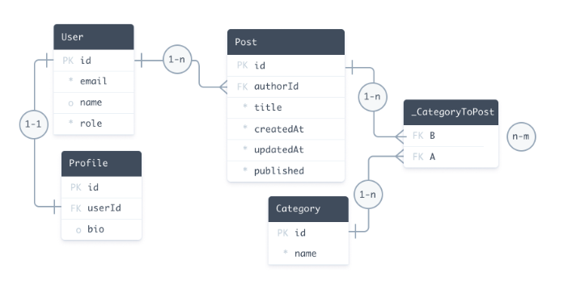

## Models（モデル）

Prismaスキーマのデータモデル定義部分は、アプリケーションのモデル（Prismaモデルとも呼ばれる）を定義します。  

モデルは以下の役割を持ちます：

- アプリケーションドメインのエンティティを表現する  
- データベース内のテーブル（PostgreSQLなどのリレーショナルデータベース）やコレクション（MongoDB）にマッピングされる  
- 生成されるPrisma Client APIで利用可能なクエリの基盤となる  

TypeScriptと併用すると、Prisma Clientはモデルやそのバリエーションに対応する型定義を自動生成するため、データベースへのアクセスを完全に型安全に行うことができます。  

以下のスキーマはブログプラットフォームを例としており、データモデル定義が示されています。


```Relational databases
datasource db {
  provider = "postgresql"
  url      = env("DATABASE_URL")
}

generator client {
  provider = "prisma-client-js"
}

model User {
  id      Int      @id @default(autoincrement())
  email   String   @unique
  name    String?
  role    Role     @default(USER)
  posts   Post[]
  profile Profile?
}

model Profile {
  id     Int    @id @default(autoincrement())
  bio    String
  user   User   @relation(fields: [userId], references: [id])
  userId Int    @unique
}

model Post {
  id         Int        @id @default(autoincrement())
  createdAt  DateTime   @default(now())
  updatedAt  DateTime   @updatedAt
  title      String
  published  Boolean    @default(false)
  author     User       @relation(fields: [authorId], references: [id])
  authorId   Int
  categories Category[]
}

model Category {
  id    Int    @id @default(autoincrement())
  name  String
  posts Post[]
}

enum Role {
  USER
  ADMIN
}
```


## データモデル定義の構成

データモデル定義は以下で構成されます：

- **Models（モデル）**  
  複数のフィールドを定義するモデルの基本単位。モデル間のリレーションも含まれます。
- **Enums（列挙型）**  
  コネクタが列挙型をサポートしている場合に使用されます。
- **Attributes（属性）やFunctions（関数）**  
  フィールドやモデルの振る舞いを変更します。

対応するデータベースはこのような構造になります。




### サンプルデータベース

- モデルはデータソースの基礎構造にマッピングされます。
- 以下のクエリは、このデータモデルから生成されたPrisma Clientを使用して作成されます：
  - 1件のUserレコード
  - 2件のネストされたPostレコード
  - 3件のネストされたCategoryレコード


```Query Example
const user = await prisma.user.create({
  data: {
    email: 'ariadne@prisma.io',
    name: 'Ariadne',
    posts: {
      create: [
        {
          title: 'My first day at Prisma',
          categories: {
            create: {
              name: 'Office',
            },
          },
        },
        {
          title: 'How to connect to a SQLite database',
          categories: {
            create: [{ name: 'Databases' }, { name: 'Tutorials' }],
          },
        },
      ],
    },
  },
})
```


データモデルはアプリケーションのドメインを反映します。例えば：

- **Eコマースアプリケーション**  
  Customer（顧客）、Order（注文）、Item（商品）、Invoice（請求書）などのモデルが考えられます。
- **ソーシャルメディアアプリケーション**  
  User（ユーザー）、Post（投稿）、Photo（写真）、Message（メッセージ）などのモデルが考えられます。

## Introspection と Migration

データモデルを定義する方法は2つあります：

1. **手動でデータモデルを書き、Prisma Migrateを使用する方法**  
   データモデルを手動で作成し、Prisma Migrateを使ってデータベースにマッピングします。この場合、データモデルがアプリケーションのモデルに対する唯一の情報源（Single Source of Truth）となります。

2. **Introspectionを使用してデータモデルを生成する方法**  
   既存のデータベースがある場合や、SQLでスキーマを移行したい場合に、データベースを参照（introspect）してデータモデルを生成します。この場合、データベーススキーマがモデルの唯一の情報源となります。

## モデルの定義

モデルはアプリケーションドメインのエンティティを表します。  
モデルは **model ブロック** で表現され、複数のフィールドを定義します。  

上記の例では、`User`、`Profile`、`Post`、`Category` がモデルです。

### ブログプラットフォームで拡張可能なモデル例

- Comment（コメント）
- Tag（タグ）


## モデル名とテーブル／コレクションのマッピング

Prisma のモデル命名規則（単数形、PascalCase）は、データベースのテーブル名と必ずしも一致するわけではありません。  
データベースでの一般的なテーブル／コレクション命名方法は、複数形かつスネークケースを使うことです。  
例えば `comments` というテーブル名の場合、Prisma モデルは次のようになります：

```prisma
model comments {
  // フィールド定義
}
```
しかし、データベース上の comments テーブルの名前を変更せずに、命名規則に従ったモデル名を使用することもできます。
その場合、@@map 属性を使います：

```prisma
model Comment {
  // フィールド定義

  @@map("comments")
}
```
このモデル定義により、Prisma ORM は Comment モデルを自動的にデータベース上の comments テーブルにマッピングします。

補足: カラム名や enum 値には @map を、enum 名には @@map を使用することもできます。

@map と @@map は、モデルやフィールド名とデータベース上のテーブル・カラム名を分離して、Prisma Client API の形状を調整するために使われます。


### スカラー型フィールド (Scalar fields)

以下の例では、`Comment` と `Tag` モデルにいくつかのスカラー型フィールドを追加しています。  
一部のフィールドには属性（attributes）も含まれています：
```prisma
model Comment {
  id      Int    @id @default(autoincrement())
  title   String
  content String
}

model Tag {
  name String @id
}
```

### リレーション型フィールド (Relation fields)

リレーション型フィールドは、他のモデルを型として持ちます。  
例えば、`Post` モデルは複数の `Comment` を持つことができます：

#### リレーショナルデータベースの場合
```prisma
model Post {
  id       Int       @id @default(autoincrement())
  // 他のフィールド
  comments Comment[] // 1つの投稿に複数のコメントを持てる
}

model Comment {
  id     Int
  // 他のフィールド
  post   Post? @relation(fields: [postId], references: [id]) // 1つのコメントは1つの投稿に属する
  postId Int?
}
```

詳細なリレーションの例やモデル間の関係については、Prisma のリレーションドキュメントを参照してください。


### ネイティブ型マッピング (Native types mapping)

Prisma 2.17.0 以降では、ネイティブデータベース型属性（type attributes）がサポートされており、  
これはモデルのフィールドがデータベース上でどの型になるかを指定できます。

省略

### 型修飾子 (Type modifiers)

フィールドの型は、以下の 2 つの修飾子を付けることで変更できます：

- `[]` フィールドをリスト型にする  
- `?` フィールドをオプショナルにする  

> 注意: 型修飾子は組み合わせられません。オプショナルなリストはサポートされていません。


省略


### サポートされていない型 (Unsupported types)

リレーショナルデータベースをインスペクトすると、Prisma ORM でまだサポートされていないデータ型は `Unsupported` として追加されます。

省略


### 属性の定義 (Defining attributes)

属性 (Attributes) は、フィールドやモデルブロックの挙動を変更するために使用されます。  

以下の例では、3つのフィールド属性 `@id`、`@default`、`@unique` と、1つのブロック属性 `@@unique` を使用しています。

```prisma
model User {
  id        Int     @id @default(autoincrement())
  firstName String
  lastName  String
  email     String  @unique
  isAdmin   Boolean @default(false)

  @@unique([firstName, lastName])
}
```

省略

### IDフィールドの定義 (Defining an ID field)

IDはモデル内の各レコードを一意に識別するためのフィールドです。  
1つのモデルにつき、IDは1つだけ定義できます。

- **リレーショナルデータベースの場合**  
  - IDは単一フィールドでも複数フィールドの組み合わせでも定義可能
  - `@id` または `@@id` がない場合は、必須の `@unique` フィールドまたは `@@unique` ブロックを定義する必要があります

- **MongoDBの場合**  
  - IDは単一フィールドで定義し、`@id` と `@map("_id")` を付与する必要があります

#### リレーショナルデータベースでのID定義
- 単一フィールドでの定義: `@id` 属性を使用
- 複数フィールドでの定義: `@@id` 属性を使用

省略

### デフォルト値の定義 (Defining a default value)

モデルのスカラー型フィールドに対して、`@default` 属性を使ってデフォルト値を設定できます。

省略

### ユニークフィールドの定義 (Defining a unique field)

モデルのレコードを一意に識別するために、`@unique` 属性を使ってユニーク制約を設定できます。  
ユニーク属性は、単一フィールドに対して `@unique` を使うか、複数フィールドに対して `@@unique` （複合ユニーク制約）を使って設定できます。

例: 単一フィールドのユニーク制約

```prisma
model User {
  id    Int     @id @default(autoincrement())
  email String  @unique
  name  String?
}
```

省略

### インデックスの定義 (Defining an index)

モデルの1つまたは複数のフィールドに対してインデックスを定義するには、モデル内で `@@index` を使用します。  
インデックスを定義することで、検索やクエリのパフォーマンスを向上させることができます。

例: 複数カラムのインデックス

```prisma
model Post {
  id      Int     @id @default(autoincrement())
  title   String
  content String?

  @@index([title, content])
}
```

- 上記では title と content フィールドの組み合わせに対してインデックスが作成されます
- インデックス名はデータベース側で任意に設定可能です

省略

### 列挙型 (Enums) の定義 (Defining enums)

データベースコネクタが列挙型 (Enum) をサポートしている場合、Prisma スキーマで列挙型を定義できます。  
列挙型は Prisma スキーマのデータモデル上ではスカラー型として扱われるため、Prisma Client のクエリでも返り値として利用されます。

列挙型は `enum` ブロックで定義します。  
例: `User` モデルに `Role` 列挙型を持たせる場合

```prisma
model User {
  id    Int     @id @default(autoincrement())
  email String  @unique
  name  String?
  role  Role    @default(USER)
}

enum Role {
  USER
  ADMIN
}
```

- role フィールドは Role 列挙型を参照
- デフォルト値として USER を設定

### 複合型 (Composite types) の定義 (Defining composite types)

> **Info:** 複合型は MongoDB 用の Preview 機能としてバージョン 3.10.0 で追加され、バージョン 3.12.0 で正式に利用可能になりました。  
> **Warning:** 現在、複合型は MongoDB のみで利用可能です。

複合型（MongoDB では埋め込みドキュメントとして知られる）は、レコードの中に別のレコードを埋め込むことをサポートします。  
これにより新しいオブジェクト型を定義でき、モデルと同様に構造化され型が付けられます。

複合型を定義するには `type` ブロックを使用します。  
例:

```prisma
model Product {
  id     String  @id @default(auto()) @map("_id") @db.ObjectId
  name   String
  photos Photo[]
}

type Photo {
  height Int
  width  Int
  url    String
}
```
- Product モデルには Photo 複合型のリスト photos が含まれる
- 複合型は埋め込みドキュメントとして扱われる


### 関数の使用 (Using functions)

Prisma スキーマでは、いくつかの関数をサポートしており、モデルのフィールドにデフォルト値を指定する際に使用できます。

例: `createdAt` フィールドのデフォルト値として `now()` を使用する場合

```prisma
model Post {
  id        Int      @id @default(autoincrement())
  createdAt DateTime @default(now())
}
```
- cuid() や uuid() などの関数も Prisma ORM によって提供され、すべてのコネクタで使用可能
- 関数によるデフォルト値は、データベース側で生成される場合もあれば、Prisma Client 側で生成される場合もある


### リレーション (Relations)

モデル間の関係性（リレーション）については、Prisma のリレーションに関するドキュメントを参照してください。

- リレーションを定義することで、関連するモデル同士の CRUD 操作が容易になる
- 例: `User` モデルと `Post` モデルの間の 1対多リレーション


### 型定義 (Type definitions)

Prisma Client は、モデル構造を反映した型定義も生成します。これらは生成される `@prisma/client` Node モジュールの一部です。

- **TypeScript 使用時**: 生成される型定義により、データベースクエリが完全に型安全になり、コンパイル時に検証されます（`select` や `include` を使った部分的なクエリも含む）。
- **JavaScript 使用時**: 型定義は `@prisma/client` に含まれ、エディタでの IntelliSense / 補完機能が有効になります。
- 実際の型定義は `.prisma/client` フォルダ内に格納され、`@prisma/client/index.d.ts` でエクスポートされます。

#### 例: User モデルの型定義
```ts
export type User = {
  id: number
  email: string
  name: string | null
  role: string
}
```
関連フィールド（例: posts や profile）はデフォルトでは型定義に含まれません。

必要に応じて Prisma Client のヘルパー型（例: UserGetIncludePayload, UserGetSelectPayload）を使ってバリエーション型を定義できます。


### 制限事項 (Limitations)

#### レコードは一意に識別可能である必要がある

Prisma ORM では、**少なくとも1つのユニークなフィールドまたはフィールドの組み合わせを持つモデルのみ**がサポートされます。  
実際には、すべての Prisma モデルは以下のいずれかを持つ必要があります：

- `@id` または `@@id`  
  単一フィールドまたは複数フィールドによるプライマリキー制約（モデルごとに最大1つ）
- `@unique` または `@@unique`  
  単一フィールドまたは複数フィールドによるユニーク制約
